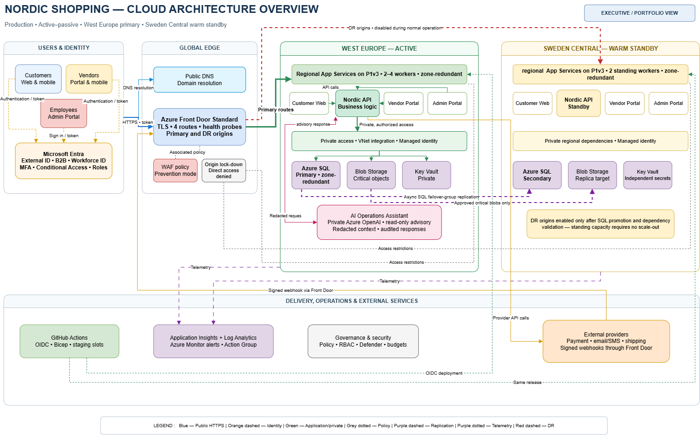

# Nordic Shopping Cloud Transformation

[](https://github.com/Amin-Azad/nordic-shopping-cloud-transformation/actions/workflows/infrastructure-validation.yml)
[](https://azure.microsoft.com/)
[](https://learn.microsoft.com/azure/azure-resource-manager/bicep/)
[](https://github.com/features/actions)
[](LICENSE)

I built this project as an end-to-end Azure cloud transformation case study for Nordic Shopping, a fictional e-commerce marketplace based in Copenhagen.

The work starts with a small on-premises environment and follows the same path I would use in a real migration: understand the business, define requirements, design the target architecture, estimate cost, assess security risks, write the infrastructure as code, build deployment guardrails, test the design, and document what happened.

This is a production-oriented design and implementation project. It is not presented as a live production system.

## The scenario

Nordic Shopping has approximately 35 employees, 40,000 customers, 150 vendors and 600 orders per day. The existing environment has limited resilience, manual operations and no tested regional recovery capability. The long-term business target is to support growth toward 400,000 customers without redesigning the platform from the beginning.

The proposed production platform uses West Europe as the primary region and Sweden Central as the disaster-recovery region. The planning baseline is approximately DKK 15,000 per month within an authorized DKK 16,500 operating envelope.

## What I implemented

| Area | Implementation |
|---|---|
| Business analysis | Business case, requirements, current-state assessment and migration roadmap |
| Architecture | Multi-region Azure design with separate application, data, security and operations concerns |
| Infrastructure as code | Subscription-scope modular Bicep with separate dev and production parameter files |
| Application hosting infrastructure | Azure App Service resources intended to host separate customer, vendor, administration and API workloads |
| Data | Azure SQL Database, Storage accounts, geo-recovery design and private connectivity |
| Identity | Microsoft Entra ID groups, managed identities, RBAC and GitHub workload identity federation |
| Network security | VNet integration, private endpoints, private DNS, NSGs, Front Door and WAF |
| Secrets | Azure Key Vault with RBAC and environment-specific protection settings |
| Monitoring | Log Analytics, Application Insights, alerts, action groups and an Azure Monitor workbook |
| Governance | Naming, tags, Azure Policy, budgets, diagnostic settings and environment controls |
| Delivery | GitHub Actions for validation, What-If, guarded deployment, cleanup and region qualification |
| Recovery | Warm-standby regional design, SQL failover planning and documented recovery procedures |

## Architecture

[](architecture/diagrams/exports/01-architecture-overview.png)

Public traffic is designed to enter through Azure Front Door and Web Application Firewall. The infrastructure provisions separate App Service resources intended to host future customer, vendor, administration and API workloads. Managed identities are configured for service access. SQL Database, Storage and Key Vault are designed to use private endpoints and private DNS.

The production design places the active primary workload in West Europe and the warm standby in Sweden Central. Development uses separate parameters and lower-cost settings, but it keeps the same security and operational structure where practical.

Key design choices include:

- no stored Azure client secret in GitHub;
- separate identities for validation and deployment;
- managed identity instead of application credentials;
- private access to data and secrets in production;
- centralized logs and operational alerts;
- environment-specific locks, policy effects, retention and purge protection;
- manual approval before deployment or cleanup;
- explicit recovery and cleanup procedures.

More detail is available in the [target architecture](docs/architecture/04-target-architecture.md) and [architecture decisions](docs/architecture/10-architecture-decisions.md).

## Infrastructure as code

The Bicep implementation begins at subscription scope in [infra/bicep/main.bicep](infra/bicep/main.bicep). Reusable modules are grouped by responsibility:

```text
infra/bicep/
├── bootstrap/          Deployment identities and supporting access
├── environments/       Development and production parameters
├── modules/
│   ├── ai/             Optional Azure AI services
│   ├── compute/        App Service plans and web applications
│   ├── data/           SQL, failover and Storage
│   ├── governance/     Resource groups, policy and budgets
│   ├── identity/       Managed identities and RBAC
│   ├── monitoring/     Logs, alerts, diagnostics and workbook
│   ├── networking/     VNets, private DNS, endpoints and Front Door
│   └── security/       Key Vault and security controls
├── orchestration/      Ordered regional deployments
└── main.bicep          Subscription-scope entry point
```

Development and production compile from the same modular codebase while retaining different cost, resilience and safety settings.

## CI/CD and deployment safety

The repository uses five GitHub Actions workflows:

| Workflow | Purpose |
|---|---|
| [Infrastructure validation](.github/workflows/infrastructure-validation.yml) | Format, lint, build, compile parameters, run regression tests and reject unwanted generated files |
| [Dev What-If](.github/workflows/dev-what-if.yml) | Authenticate with OIDC, verify readiness and preview the exact subscription deployment |
| [Dev deployment](.github/workflows/dev-deployment.yml) | Require a reviewed What-If, protected-environment approval and an explicit deployment confirmation |
| [Dev cleanup](.github/workflows/dev-cleanup.yml) | Remove only allowlisted dev resources after a separate approval and exact confirmation |
| [Dev region qualification](.github/workflows/dev-region-qualification.yml) | Check SQL availability, App Service SKU quota and the separate regional Total VMs quota |

The deployment path is intentionally strict:

1. validate the Bicep source and both environment parameter files;
2. authenticate to Azure through OIDC;
3. verify subscription, tenant, providers, permissions, quota and existing-resource conflicts;
4. match the approved What-If run to the exact commit;
5. run a final pre-deployment What-If;
6. require protected-environment approval and the exact confirmation phrase;
7. deploy or stop on the first terminal Azure failure;
8. upload evidence even when deployment fails;
9. run cleanup through a separate manual workflow;
10. verify that no scoped dev resources remain.

## Verified results

| Check | Result | Evidence |
|---|---|---|
| Bicep formatting, lint and build | Passed | [Infrastructure validation run 32127953187](https://github.com/Amin-Azad/nordic-shopping-cloud-transformation/actions/runs/32127953187) |
| GitHub Actions OIDC | Passed | Azure sign-in completed in deployment, cleanup and qualification workflows |
| Subscription and provider checks | Passed before Attempt 2 resource creation | [Deployment run 32123367196](https://github.com/Amin-Azad/nordic-shopping-cloud-transformation/actions/runs/32123367196) |
| Final pre-deployment What-If | Passed before Attempt 2 resource creation | [Deployment run 32123367196](https://github.com/Amin-Azad/nordic-shopping-cloud-transformation/actions/runs/32123367196) |
| Attempt 2 regression checks | Passed | [Correction PR #8](https://github.com/Amin-Azad/nordic-shopping-cloud-transformation/pull/8) |
| Guarded cleanup | Passed | [Cleanup run 32124949474](https://github.com/Amin-Azad/nordic-shopping-cloud-transformation/actions/runs/32124949474) |
| Independent zero-resource verification | Passed | No dev resource groups, resources, policies, budgets or Key Vault remnants found |
| Region qualification | No tested pair qualified | [Qualification run 32129650123](https://github.com/Amin-Azad/nordic-shopping-cloud-transformation/actions/runs/32129650123) |
| Complete dev deployment | Not completed | Subscription quota and SQL administrator deployment errors |
| Production deployment | Not attempted | Intentionally held because the dev qualification criteria were not met |

> A successful template build or What-If is not the same as a successful deployment. I keep those results separate throughout this repository.

## What happened during deployment

Two guarded dev deployments reached Azure resource creation and failed safely.

### Attempt 1

The first attempt exposed several issues that static validation had not detected:

- Key Vault rejected an explicitly disabled purge-protection property;
- Azure OpenAI rejected dynamic throttling for the selected account;
- SQL provisioning was restricted in the selected region;
- App Service had no available VM quota;
- SQL rejected the selected guest-user administrator;
- concurrent operations affected shared networking resources.

The partial environment was inventoried and removed. The infrastructure, identity model, dependency ordering, readiness checks and cleanup automation were corrected. CI passed and a fresh What-If completed successfully before another deployment was considered.

[Read the Attempt 1 incident record](docs/deployment-attempts/deployment-attempt-1-failed.md).

### Attempt 2

The second attempt passed CI, OIDC authentication, subscription readiness, provider validation and the final What-If. Azure then rejected resource creation for two reasons:

- the selected regions had a separate App Service Total VMs quota of zero;
- both SQL servers rejected the Entra administrator login payload.

Cleanup run `32124949474` completed successfully. Independent checks confirmed that no Nordic Shopping dev resource groups, resources, policies, budgets, active or soft-deleted Key Vaults, or tagged dev resources remained.

The correction added validation for both App Service quota dimensions, subscription-specific region qualification, SQL Entra administrator regression checks and corrected server-creation behavior. The qualification workflow then confirmed that none of the tested region and SKU combinations were compatible with the current subscription.

- [Read the Attempt 2 incident record](docs/deployment-attempts/deployment-attempt-2-controlled-failure.md)
- [Review the Attempt 2 evidence](docs/evidence/attempt-2/README.md)

These failures are included because they show the operational part of the work: detecting incorrect assumptions, preserving evidence, correcting the implementation, testing the correction and stopping when the subscription could not support the design.

## Current project status

Completed:

- business, security, cost and migration documentation;
- target architecture and nine editable architecture diagrams;
- modular Bicep for development and production;
- CI validation and regression tests;
- GitHub Actions OIDC authentication;
- guarded What-If, deployment, cleanup and qualification workflows;
- two controlled deployment attempts;
- verified cleanup after both attempts;
- root-cause analysis and corrective changes.

Not completed:

- application source code, authentication, tenant isolation, uploads and business features;
- application health endpoints, tests and delivery workflows;
- a complete live development environment;
- end-to-end application testing in Azure;
- production deployment;
- live disaster-recovery execution.

No further Azure deployment should be attempted until the subscription passes the repository's qualification checks or a compatible subscription and SKU combination is selected.

## Documentation

| Document | Contents |
|---|---|
| [Business Case](docs/business/01-business-case.md) | Business drivers, expected outcomes, investment and approval |
| [Business Requirements](docs/business/02-business-requirements.md) | Functional, security, availability, recovery and acceptance requirements |
| [Current Environment](docs/business/03-current-environment.md) | Existing systems, limitations, dependencies and risks |
| [Target Architecture](docs/architecture/04-target-architecture.md) | Azure services, topology, integration and resilience |
| [Migration Strategy](docs/migration/05-migration-strategy.md) | Migration waves, testing, cutover, rollback and stabilization |
| [Cost Estimation](docs/cost/06-cost-estimation.md) | Production baseline, migration costs, forecasts and controls |
| [Security Assessment](docs/security/07-security-assessment.md) | Threats, risks, treatment priorities and residual risk |
| [Security Strategy](docs/security/08-security-strategy.md) | Identity, network, data, monitoring and incident response |
| [Project Roadmap](docs/operations/09-project-roadmap.md) | Implementation sequence, deliverables and gates |
| [Architecture Decisions](docs/architecture/10-architecture-decisions.md) | Decisions, alternatives, consequences and review triggers |
| [Attempt 1 Record](docs/deployment-attempts/deployment-attempt-1-failed.md) | Failure, containment, corrections and re-qualification |
| [Attempt 2 Record](docs/deployment-attempts/deployment-attempt-2-controlled-failure.md) | Failure, cleanup, root causes and regression protection |
| [Attempt 2 Evidence](docs/evidence/attempt-2/README.md) | Workflow evidence, screenshots and video notes |
| [Complete Project Explainer](docs/project-overview/nordic-shopping-cloud-transformation-project-explainer.pdf) | Guided overview of the full case study |

The Markdown documents and Draw.io files are the authoritative editable sources.

## Architecture diagrams

| Diagram | Preview | Editable source |
|---|---|---|
| Architecture overview | [PNG](architecture/diagrams/exports/01-architecture-overview.png) | [Draw.io](architecture/diagrams/source/01-architecture-overview.drawio) |
| Identity and traffic flow | [PNG](architecture/diagrams/exports/02-identity-and-traffic-flow.png) | [Draw.io](architecture/diagrams/source/02-identity-and-traffic-flow.drawio) |
| Regional network and data | [PNG](architecture/diagrams/exports/03-regional-network-and-data.png) | [Draw.io](architecture/diagrams/source/03-regional-network-and-data.drawio) |
| Deployment and operations | [PNG](architecture/diagrams/exports/04-deployment-and-operations.png) | [Draw.io](architecture/diagrams/source/04-deployment-and-operations.drawio) |
| Disaster recovery | [PNG](architecture/diagrams/exports/05-disaster-recovery.png) | [Draw.io](architecture/diagrams/source/05-disaster-recovery.drawio) |
| Full security architecture | [PNG](architecture/diagrams/exports/06-full-security-architecture.png) | [Draw.io](architecture/diagrams/source/06-full-security-architecture.drawio) |
| Current on-premises architecture | [PNG](architecture/diagrams/exports/07-current-on-premises-architecture.png) | [Draw.io](architecture/diagrams/source/07-current-on-premises-architecture.drawio) |
| Migration and cutover flow | [PNG](architecture/diagrams/exports/08-migration-and-cutover-flow.png) | [Draw.io](architecture/diagrams/source/08-migration-and-cutover-flow.drawio) |
| Monitoring and incident response | [PNG](architecture/diagrams/exports/09-monitoring-and-incident-response-flow.png) | [Draw.io](architecture/diagrams/source/09-monitoring-and-incident-response-flow.drawio) |

## Repository map

```text
.
├── .github/workflows/       CI, What-If, deployment, cleanup and qualification
├── architecture/            Diagram exports and editable Draw.io sources
├── docs/                    Business and technical documentation
├── infra/bicep/             Subscription-scope infrastructure as code
├── scripts/                 Readiness, validation, cleanup and qualification tools
└── tests/                   Infrastructure regression tests
```

## How to review this project

If you have only a few minutes:

1. View the [architecture overview](architecture/diagrams/exports/01-architecture-overview.png).
2. Read the [target architecture](docs/architecture/04-target-architecture.md).
3. Review the [Bicep entry point](infra/bicep/main.bicep).
4. Open the [GitHub Actions workflows](.github/workflows).
5. Read the [Attempt 2 evidence summary](docs/evidence/attempt-2/README.md).

For a deeper review, follow the numbered documents from the business case through the architecture decisions, then compare the Attempt 1 and Attempt 2 incident records.

## What this project demonstrates

This repository shows how I approach cloud engineering work beyond drawing an architecture diagram:

- translate business requirements into technical controls;
- make cost and resilience trade-offs explicit;
- build reusable infrastructure rather than one large template;
- use identity federation and least-privilege access;
- treat What-If, deployment and cleanup as separate controlled operations;
- validate live subscription constraints before creating resources;
- preserve evidence when a deployment fails;
- correct the system based on observed Azure behavior;
- state clearly what has and has not been deployed.

## Security

Do not commit credentials, connection strings, certificates, access tokens or environment-specific secrets.

See [SECURITY.md](SECURITY.md) for the security policy and reporting process.

## Contributing

See [CONTRIBUTING.md](CONTRIBUTING.md) for branch, commit, validation and pull-request conventions.

## Disclaimer

Nordic Shopping is a fictional company created for this portfolio case study. The business scale, requirements, architecture and operating constraints are realistic, but this repository does not represent a production system operated by a real organization.

## License

This project is available under the [MIT License](LICENSE).
