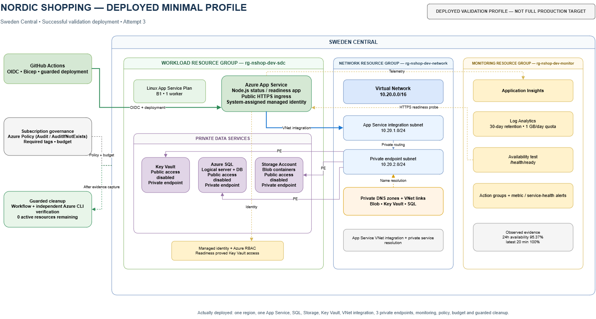
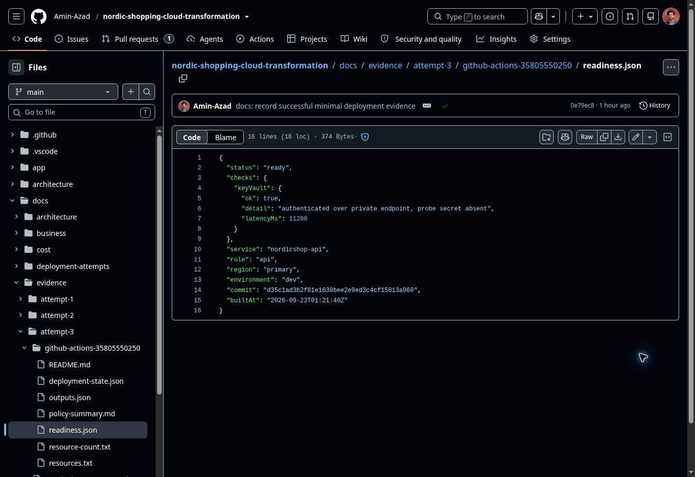
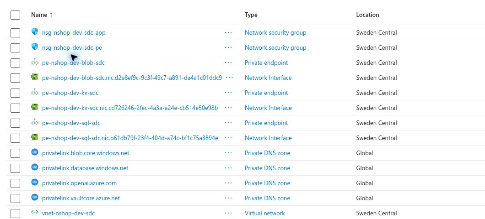

# Nordic Shopping Cloud Transformation

[](https://github.com/Amin-Azad/nordic-shopping-cloud-transformation/actions/workflows/infrastructure-validation.yml)
[](https://azure.microsoft.com/)
[](https://learn.microsoft.com/azure/azure-resource-manager/bicep/)
[](https://github.com/features/actions)
[](LICENSE)

Azure infrastructure project built with modular Bicep and delivered through
guarded GitHub Actions using OIDC.

**Status: deployed, verified and cleaned up.** A single-region validation
profile ran successfully in Sweden Central with App Service, Azure SQL, Storage,
Key Vault, private endpoints, managed identity, monitoring and Azure Policy.
Runtime readiness passed, evidence was captured, and the temporary environment
was later removed with zero active resources remaining.

The full two-region production design is retained as the target architecture and
is compiled and What-If validated, but it was not deployed because of
subscription quota and service constraints.

**Stack:** Azure App Service · Azure SQL · Key Vault · Storage · Private
Endpoints · Private DNS · Managed Identity · Azure RBAC · Azure Policy · Azure
Monitor · Application Insights · Bicep · GitHub Actions · OIDC

## What actually ran in Azure

[](architecture/diagrams/exports/10-deployed-minimal.png)

The deployed profile was intentionally smaller than the full production target.
It reused the same platform modules while reducing the deployment to one region,
one application and lower-cost Azure service sizes.

| Check | Result |
| --- | --- |
| Deployment | Succeeded |
| Region | Sweden Central |
| Resources | 45 across 3 workload resource groups |
| Application publication | Successful |
| Readiness | HTTP 200 |
| Key Vault dependency | `keyVault.ok: true` |
| Key Vault public access | Disabled |
| SQL public access | Disabled |
| Storage public access | Disabled |
| Private endpoints | 3 deployed |
| Availability | 95.37% over 24h; latest 20 min 100% |
| Azure Policy | 36% observed audit-mode compliance |
| Observed cost | DKK 6.32 at capture |
| Cleanup | 0 active resources remaining |

## Runtime proof

The strongest runtime check was the application readiness endpoint.



The response included:

```json
{
  "keyVault": {
    "ok": true
  }
}
```

That result tested more than application uptime. It proved that App Service could
run the deployed application, use its system-assigned managed identity, receive
the required Azure RBAC permissions, resolve the private Key Vault hostname and
reach Key Vault through the private network path.

The deployed networking evidence also confirmed the three private endpoints used
for SQL, Key Vault and Blob Storage.



## Environments

| Profile | Purpose | Status |
| --- | --- | --- |
| `minimal` | Single-region, lower-cost deployment proof | Deployed, verified and cleaned up |
| `dev` | Full two-region design with development sizing | Attempted twice; blockers documented |
| `prod` | Production-oriented configuration | Compiled in CI only |

The minimal profile does not replace the full design. It exists to provide
verified Azure deployment evidence without weakening the intended production
architecture.

## Guarded deployment lifecycle

The deployment path was designed to fail safely rather than push changes
directly into Azure.

```text
OIDC login
→ subscription and identity checks
→ quota and regional readiness checks
→ Azure What-If
→ guarded deployment
→ application publication
→ readiness and smoke tests
→ evidence capture
→ guarded cleanup
→ independent zero-resource verification
```

GitHub Actions authenticates through workload identity federation, so no
long-lived Azure client secret is stored in the repository.

The main workflows are:

- [Infrastructure validation](.github/workflows/infrastructure-validation.yml)
- [Dev What-If](.github/workflows/dev-what-if.yml)
- [Minimal profile validation](.github/workflows/minimal-validate.yml)
- [Minimal deployment](.github/workflows/minimal-deploy.yml)
- [Minimal cleanup](.github/workflows/minimal-cleanup.yml)

## Failure and correction history

**Attempt 1** reached Azure but exposed configuration, dependency and
subscription-capacity issues that static Bicep validation had not detected.
The partial environment was cleaned up, the causes were investigated and the
deployment guards were improved.

**Attempt 2** passed the earlier validation gates but failed during resource
creation. The main causes were the App Service `Total Regional VMs` quota and
the Azure SQL Entra administrator creation path. Regression tests and stronger
pre-deployment checks were added before another deployment was attempted.

**Attempt 3** used the minimal profile in Sweden Central and completed
successfully. Application publication, runtime readiness, private networking,
managed identity, monitoring, policy observation, cost capture and guarded
cleanup were all recorded as evidence.

See:

- [Attempt 1](docs/deployments/attempt-1.md)
- [Attempt 2](docs/deployments/attempt-2.md)
- [Attempt 3](docs/deployments/attempt-3.md)
- [Attempt 3 evidence](docs/evidence/attempt-3/README.md)

## How I worked

The repository was developed through branches, pull requests and CI checks rather
than direct-to-main changes. Representative examples:

- [PR #5 — requalify the guarded development deployment](https://github.com/Amin-Azad/nordic-shopping-cloud-transformation/pull/5)
  Corrected deployment configuration, added readiness checks and improved guarded cleanup.

- [PR #8 — guard Attempt 2 quota and SQL Entra failures](https://github.com/Amin-Azad/nordic-shopping-cloud-transformation/pull/8)
  Added regression coverage for the real App Service quota and SQL administrator failures found during deployment.

- [PR #21 — add proven minimal Azure deployment profile](https://github.com/Amin-Azad/nordic-shopping-cloud-transformation/pull/21)
  Added the successfully deployed single-region profile with private networking, managed identity, monitoring and runtime verification.

## Full target architecture

The full design uses West Europe as the primary region and Sweden Central as a
warm standby. It includes Azure Front Door, WAF integration, four App Services,
regional VNets, private data services, monitoring, policy, budgets and a
controlled SQL recovery design.

[View the full architecture](architecture/diagrams/exports/01-architecture-overview.png)

The complete design and major engineering decisions are documented in
[Architecture](docs/architecture.md), with separate [Security](docs/security.md)
and [Cost](docs/cost.md) documents.

## Scope

Nordic Shopping is a fictional company used for this portfolio project.

What is proven:

- real Azure deployment of the minimal profile;
- GitHub Actions OIDC authentication;
- application publication and readiness;
- managed identity access to Key Vault;
- private endpoints and private DNS;
- monitoring and availability testing;
- Azure Policy observation;
- real deployment cost capture;
- guarded cleanup and independent zero-resource verification.

What is not claimed:

- deployment of the full production architecture;
- production load testing;
- live regional disaster-recovery failover;
- production operation for a real company.

The goal of the repository is to show the complete engineering lifecycle:
design, infrastructure as code, CI/CD controls, deployment troubleshooting,
runtime verification, evidence collection and safe cleanup.
