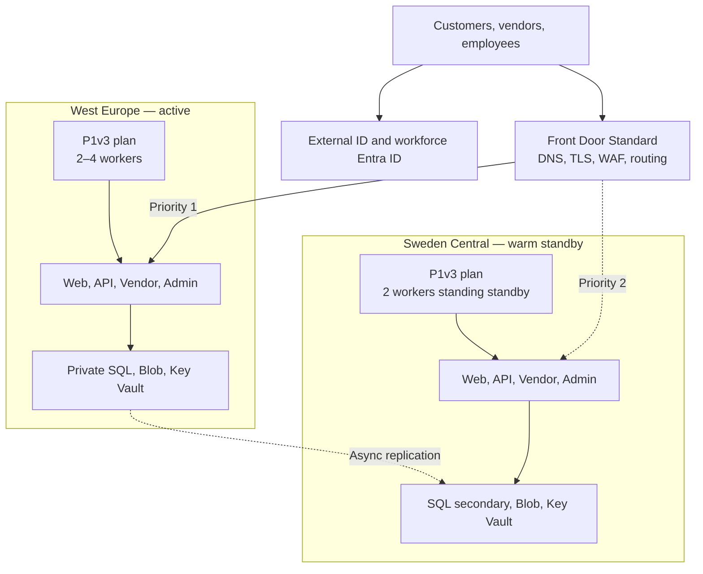
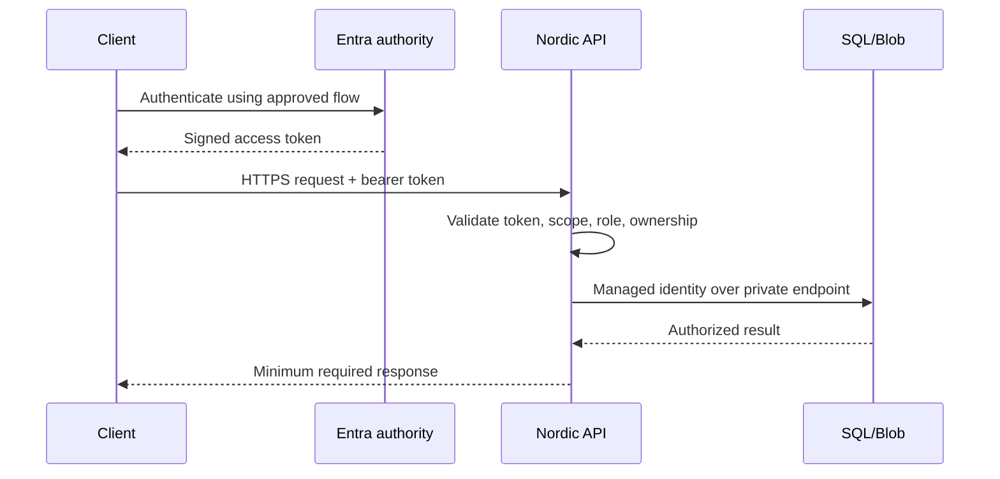
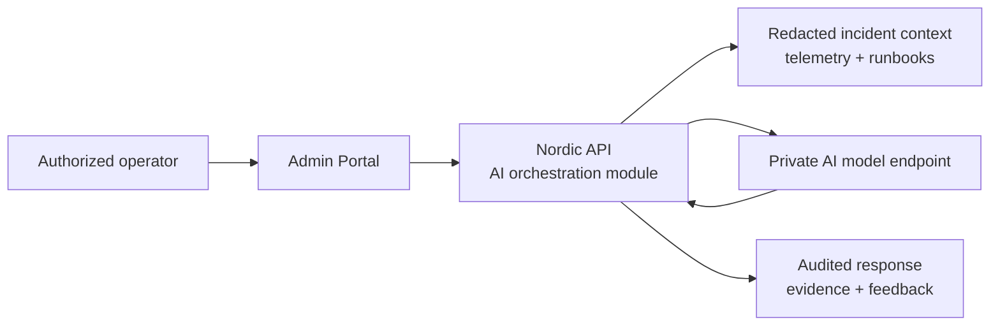
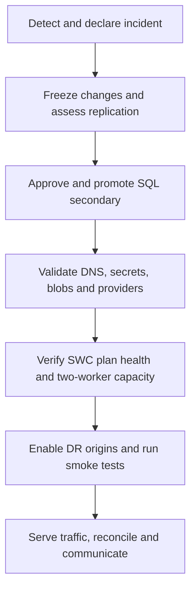

# Nordic Shopping Cloud Transformation — Target Architecture

| Item | Approved value |
|---|---|
| Document | Target Architecture — Final V6 |
| Company | Nordic Shopping |
| Owner | Amin Azad |
| Version | Final V6 (8.0 — adds SWC standing-capacity and SQL zone-redundancy resilience decisions) |
| Status | Implementation source of truth |
| Date | 4 August 2026 |
| First issued | 15 June 2026 |
| Primary region | West Europe (`westeurope`) |
| DR region | Sweden Central (`swedencentral`) |
| Environment covered | Production; non-production differences stated separately |
| Monthly Azure planning baseline | DKK 15,000 for normal operation, excluding VAT, labour and third-party transaction fees |
| Monthly Azure authorized budget | DKK 16,500, excluding VAT, labour and third-party transaction fees |
| Supersedes | All earlier target-architecture drafts prior to this Final V6 |

## 1. Purpose and authority

This document defines the exact Azure target that Nordic Shopping will build. It governs the Bicep modules, application deployment, identity configuration, network design, migration, security controls, observability, disaster recovery and cost model. Earlier target-architecture drafts are superseded.

The baseline supports approximately 40,000 registered customers, 150 active vendors and 600 orders per day. Initial sizing is a testable starting point, not a claim that the same capacity will support the three-year target of 250,000 customers, 800 vendors and 5,000 daily orders.

No production cutover occurs until load, security, recovery and cost gates in Section 24 pass. Availability, RTO and RPO are business objectives measured through testing; they are not guarantees created by choosing one Azure service.

### 1.1 Related project documents

| Document | Relationship to this architecture |
|---|---|
| `docs/business/01-business-case.md` | Business justification and outcomes |
| `docs/business/02-business-requirements.md` | Business and non-functional requirements |
| `docs/business/03-current-environment.md` | On-premises source environment and migration drivers |
| `docs/migration/05-migration-strategy.md` | Migration waves, rehearsals and cutover controls |
| `docs/cost/06-cost-estimation.md` | Authoritative cost forecast and growth model |
| `docs/security/07-security-assessment.md` | Security risks, control coverage and residual risks |
| `docs/security/08-security-strategy.md` | Technical security implementation and attack-defence model |
| `docs/operations/09-project-roadmap.md` | Sixteen-week delivery sequence and approval gates |
| `docs/architecture/10-architecture-decisions.md` | Full collection of 16 approved Architecture Decision Records |

If another document conflicts with this target architecture, the latest formally approved ADR governs the decision and this document must then be updated through change control.

## 2. Fixed implementation decisions

| Area | Final V6 decision |
|---|---|
| Architecture style | Managed PaaS, modular monolith, API-owned business logic |
| Regional model | Active-passive; West Europe active, Sweden Central warm standby |
| Public ingress | Azure Front Door Standard with one route and origin group per public application |
| Edge protection | Front Door WAF custom match/rate-limit rules; origin access restrictions |
| Applications | Customer Web, Nordic API, Vendor Portal and Admin Portal as separate Linux App Services |
| Mobile | Existing customer/vendor apps are API clients, not Azure hosting resources |
| Compute SKU | Linux App Service Premium v3 `P1v3` |
| Compute count | WEU: 2–4 instances; SWC: 2 standing standby instances, no scale-up delay before serving DR traffic |
| Deployments | One staging slot per app in production; slot swap after validation |
| Database | Azure SQL Database General Purpose, provisioned 2 vCores, zone-redundant primary with locally redundant backup storage |
| Database DR | Azure SQL failover group to an equal-size secondary; manual promotion initially |
| Object data | Private StorageV2 account per region; LRS baseline plus object replication for selected critical blobs |
| Secrets | One private Key Vault per region; RBAC, soft delete and purge protection |
| Customer identity | Microsoft Entra External ID external tenant |
| Vendor identity | Entra B2B guest users in workforce tenant |
| Employee identity | Workforce Entra ID, MFA and Conditional Access |
| Workload identity | System-assigned managed identity for every App Service |
| Network | One VNet per region, delegated integration subnet, private-endpoint subnet and Private DNS |
| Delivery | Bicep and GitHub Actions with OIDC workload federation |
| Observability | Application Insights workspace-based resource, Log Analytics, Azure Monitor alerts and workbooks |
| AI | Read-only AI Operations Assistant delivered in release 1 after monitoring acceptance; no autonomous actions |

Not included in release 1: Front Door Premium, API Management, Service Bus, Redis, Kubernetes, virtual machines, Application Gateway, Azure Load Balancer, Azure AI Search, active-active database writes, customer-facing generative AI and direct public uploads.

## 3. Architecture principles

- Managed identities replace Azure access keys and client secrets wherever supported.
- SQL, Storage and Key Vault have public network access disabled.
- Only the API accesses transactional data; portals and clients never connect directly.
- Apps remain independently deployable even while sharing regional compute.
- Production starts with at least two active App Service workers.
- The same regional Bicep modules build primary and DR infrastructure.
- Releases are backward compatible, observable and reversible.
- Replication, high availability and backup are separate controls.
- Business operations that can be retried use idempotency keys and reconciliation.
- Production changes and disaster declaration require named human approval.

## 4. Workload and trust boundaries

| Workload | Caller | Function | Data-plane permissions |
|---|---|---|---|
| Customer Web | Public customers | Catalogue, checkout and account UI | None |
| Customer Mobile | External ID users | Mobile API client | None |
| Vendor Portal | Approved B2B guests | Products, inventory and fulfilment UI | None |
| Vendor Mobile | Approved B2B guests | Mobile API client | None |
| Admin Portal | Workforce users | Support, finance and operations UI | None |
| Nordic API | All approved clients | Authorization, workflows, data and integrations | SQL, Blob, Key Vault |
| GitHub Actions | Approved repositories/environments | Infrastructure and app delivery | Deployment scopes only |
| Operations | Entra groups | Monitoring, incident response and controlled administration | Role-specific |

The API verifies token issuer, audience, signature, expiry and scopes, then applies application roles, vendor/tenant membership, resource ownership and action-level authorization. A visible button in a portal is never treated as authorization.

## 5. End-to-end topology



Front Door is the public Layer 7 entry point and performs inter-region routing. App Service distributes requests across workers in each plan. No separate Azure Load Balancer is needed because the platform contains no public VM pool or Layer 4 workload.

## 6. Subscription, resource groups and naming

One production subscription is preferred. If the portfolio is built in a single personal subscription, resource-group scope is used until a dedicated subscription is available.

| Resource group | Region | Contents |
|---|---|---|
| `rg-nshop-prod-shared` | Global/WEU metadata | Front Door, WAF, Log Analytics, Application Insights, action group |
| `rg-nshop-prod-weu` | West Europe | Active apps, VNet, SQL, Storage, Key Vault, private endpoints |
| `rg-nshop-prod-swc` | Sweden Central | DR apps, VNet, SQL secondary, Storage, Key Vault, private endpoints |
| `rg-nshop-nonprod-weu` | West Europe | Development/test at reduced size; no standing DR |

Naming pattern: `<type>-nshop-<environment>-<region>[-<workload>]`. Globally unique resources append a deterministic Bicep `uniqueString(subscription().id, environment, region)` suffix.

Mandatory tags: `application=nordic-shopping`, `environment`, `owner`, `costCentre`, `dataClassification`, `criticality`, `managedBy=bicep`.

## 7. Exact production resource inventory

| Azure type | Name pattern | Qty | SKU/configuration |
|---|---|---:|---|
| Front Door profile | `afd-nshop-prod` | 1 | Standard_AzureFrontDoor |
| Front Door endpoint | `fde-nshop-prod-<unique>` | 1 | Four custom domains/routes |
| WAF policy | `waf-nshop-prod` | 1 | Custom rules; detection then prevention |
| App Service plan | `asp-nshop-prod-weu` | 1 | Linux P1v3; zone-redundant; 2 default, 2 min, 4 max |
| App Service plan | `asp-nshop-prod-swc` | 1 | Linux P1v3; zone-redundant; 2 standing standby workers, no scale-up delay for DR |
| Linux web apps | `app-nshop-prod-<region>-{web|api|vendor|admin}` | 8 | HTTPS only, MI, VNet integration, health check |
| Staging slots | `<app>/slots/staging` | 8 | Same plan workers; zero durable local state |
| SQL logical server | `sql-nshop-prod-<region>-<unique>` | 2 | Entra admin, public access disabled |
| SQL database | `sqldb-nshop-prod` | 2 | GP provisioned 2 vCore, zone-redundant primary; same compute/storage on secondary |
| SQL failover group | `fog-nshop-prod` | 1 | Read-write listener; manual promotion initially |
| Storage account | `stnshopprod<region><unique>` | 2 | StorageV2, Standard_LRS, hot, TLS 1.2+, private only |
| Key Vault | `kv-nshop-prod-<region>-<unique>` | 2 | Standard, RBAC, purge protection, private only |
| VNet | `vnet-nshop-prod-<region>` | 2 | /16 address space |
| Foundry/Azure OpenAI resource | `aoai-nshop-prod-weu-<unique>` | 1 | Standard consumption; EU-approved small text-model deployment named `ops-assistant` |
| AI private endpoint | `pep-nshop-prod-weu-aoai` | 1 | Private access from the API workload only |
| Private endpoints | `pep-nshop-prod-<region>-{sql|blob|kv}` | 6 | One per service per region |
| Private DNS zones | SQL, Blob and Key Vault zones in both regions; Azure OpenAI zone in West Europe only | 7 regional links | Four zones linked to the West Europe VNet and three zones linked to the Sweden Central VNet |
| Log Analytics | `law-nshop-prod` | 1 | 30-day interactive retention baseline |
| Application Insights | `appi-nshop-prod` | 1 | Workspace based; role names separate apps |
| Action group | `ag-nshop-prod-operations` | 1 | Primary/secondary responders |
| Budget | `budget-nshop-prod-monthly` | 1 | 50/70/85/95/100% actual, 90% forecast (early warning) and 110% forecast (formal review) notifications |

`P1v3` is the fixed starting compute SKU. Its adequacy must be proven with production-like load and staging-slot overhead. All apps and slots on a plan share the same workers, CPU and memory; staging is therefore not free capacity.

## 8. Network design

### 8.1 Address plan

| Region | VNet | Integration subnet | Private endpoint subnet | Reserved future subnet |
|---|---|---|---|---|
| WEU | `10.10.0.0/16` | `10.10.1.0/24` | `10.10.2.0/24` | `10.10.3.0/24` |
| SWC | `10.20.0.0/16` | `10.20.1.0/24` | `10.20.2.0/24` | `10.20.3.0/24` |

The integration subnet is delegated exclusively to `Microsoft.Web/serverFarms`; no private endpoints are placed there. `privateEndpointNetworkPolicies` is disabled on the private-endpoint subnet as required by the service. Address space is non-overlapping so peering can be added later, although normal runtime does not require it.

### 8.2 NSG and routing baseline

| Subnet | Inbound | Outbound |
|---|---|---|
| App integration | VNet/default platform traffic only; it is not an ingress path | Allow HTTPS to Azure dependencies/private endpoints; deny rules added only after service-tag and DNS validation |
| Private endpoint | Only required VNet sources; platform rules retained | Response/platform traffic |

No custom route table or firewall is deployed in release 1. `WEBSITE_VNET_ROUTE_ALL=1` routes app outbound traffic through VNet integration. Egress allow-listing through Azure Firewall/NAT Gateway is a future requirement if compliance or stable third-party source IPs demand it.

### 8.3 Private DNS

| Zone | Records created by private endpoints |
|---|---|
| `privatelink.database.windows.net` | Both SQL logical servers |
| `privatelink.blob.core.windows.net` | Both Storage Blob endpoints |
| `privatelink.vaultcore.azure.net` | Both Key Vaults |
| `privatelink.openai.azure.com` | AI model endpoint |

West Europe links all four zones to its VNet: SQL, Blob, Key Vault and Azure OpenAI. Sweden Central links only the SQL, Blob and Key Vault zones to its VNet. The Azure OpenAI private DNS zone is not linked to Sweden Central because the approved design has no Azure OpenAI resource or private endpoint in the DR region.

From each regional API app, deployment tests must resolve the applicable SQL server name and failover-group listener to private addresses, together with that region's Blob and Key Vault names. The West Europe API must also resolve the Azure OpenAI endpoint privately. Public network access is disabled only after private resolution and identity access tests pass.

## 9. DNS, Front Door and ingress

### 9.1 Routes and origins

| Custom domain | Route | Origin group | Primary origin | DR origin |
|---|---|---|---|---|
| `www.nordicshopping.dk` | `route-web` | `og-web` | WEU Web, priority 1 | SWC Web, priority 2 |
| `api.nordicshopping.dk` | `route-api` | `og-api` | WEU API, priority 1 | SWC API, priority 2 |
| `vendor.nordicshopping.dk` | `route-vendor` | `og-vendor` | WEU Vendor, priority 1 | SWC Vendor, priority 2 |
| `admin.nordicshopping.dk` | `route-admin` | `og-admin` | WEU Admin, priority 1 | SWC Admin, priority 2 |

All routes accept HTTPS only, redirect HTTP to HTTPS, preserve the original host, enable compression where appropriate and use managed certificates. Customer web static assets may be cached only when response headers explicitly permit it. API, authenticated pages and administration responses are not cached.

### 9.2 Health probes and failover

| Setting | Value |
|---|---|
| Path | `/health/ready` |
| Protocol/method | HTTPS `HEAD` |
| Interval | 30 seconds |
| Sample size | 4 |
| Successful samples | 3 |
| Origin response | 200 only when regional mandatory dependencies are ready |

Each workload has a separate origin group so one failed portal does not force unrelated applications to another region. The DR API origin remains disabled or unhealthy for business traffic until the DR database has been promoted and the incident commander authorizes recovery; this prevents Front Door from sending writes to an unprepared secondary.

### 9.3 WAF custom-policy baseline

| Priority | Rule | Action |
|---:|---|---|
| 100 | Emergency deny IP ranges | Block |
| 110 | Admin domain outside approved countries/IPs, when business-approved | Block |
| 120 | Unsupported HTTP methods (`TRACE`, `TRACK`, others not required) | Block |
| 130 | Request body or upload path above application limit | Block |
| 200 | API anonymous rate threshold per socket IP | Rate limit |
| 210 | Authentication endpoint stricter threshold | Rate limit |
| 220 | Admin endpoint strict threshold | Rate limit |

Thresholds are established from load tests and normal-traffic observation. The WAF runs in detection while tuning, then prevention before go-live. Front Door Standard does not supply the Premium managed rule sets or Private Link origins; this is an explicit residual risk and upgrade trigger.

### 9.4 Origin lock-down

Each app's main site access restrictions:

1. allow service tag `AzureFrontDoor.Backend`;
2. require header `X-Azure-FDID` equal to this Front Door profile ID;
3. deny all unmatched traffic;
4. apply an independent default-deny rule set to the SCM site;
5. allow SCM deployments only from the approved delivery mechanism.

Tests must prove that direct `azurewebsites.net` application requests and forged requests without the correct Front Door ID are denied.

## 10. Application hosting configuration

| Setting | Production value |
|---|---|
| OS/runtime | Linux; Node.js 24 LTS, subject to App Service regional runtime validation before deployment |
| Architecture | 64-bit |
| HTTPS/TLS | HTTPS only; minimum TLS 1.2 or current supported higher baseline |
| FTPS | Disabled |
| Always On | Enabled |
| HTTP/2 | Enabled |
| Health check | `/health/ready` |
| VNet integration | Regional integration subnet |
| Route all | Enabled |
| Identity | Separate system-assigned managed identity per app and slot where required |
| Client affinity | Disabled unless testing proves a temporary need; correctness cannot depend on it |
| Local state | Prohibited for durable files, sessions, jobs and locks |
| Application settings | Environment-specific; secrets are Key Vault references |

WEU autoscale evaluates the shared plan: minimum 2, default 2, maximum 4; add one instance when average CPU is above 70% for 10 minutes, remove one when below 35% for 20 minutes, with conservative cool-downs. Memory, response time and queueing produce alerts because plan autoscale rules may not support every signal directly. Scale settings are validated under load to prevent oscillation.

The API moves to a dedicated P1v3 plan in both regions when it repeatedly exceeds 60% of shared CPU/memory, suffers latency from another app, or needs independent scale/security. This change is made through an ADR and cost approval, not improvised during an incident.

## 11. Application component model

The initial codebase is a modular monolith behind one API deployment. Modules have explicit interfaces and own their tables logically:

| Module | Responsibilities | Key consistency rule |
|---|---|---|
| Identity/Profile | Application user/vendor mapping and preferences | Entra subject is immutable external key |
| Catalogue | Products, categories, media metadata, prices | Vendor can modify only owned catalogue |
| Inventory | Available/reserved quantities | Reservation is transactional and expires |
| Cart/Checkout | Cart validation, totals and order initiation | Server recalculates price and availability |
| Orders | Order state machine and history | Transitions are validated and auditable |
| Payments | Provider intent/reference and status | No card data; webhook and command idempotency |
| Fulfilment | Vendor acceptance, shipment and delivery events | Vendor ownership enforced on every action |
| Notifications | Email/SMS/push requests and delivery status | Failures never roll back committed orders |
| Administration | Support actions, refunds and reports | High-risk changes require role and audit event |

Controllers do not access SQL directly; they call application services. Data access is parameterized. Cross-module workflows use one transaction where short and local; external calls use the transactional outbox/retry table.

## 12. Authentication and authorization flows



Customer clients use Authorization Code with PKCE. Vendor and employee applications use the workforce tenant and Conditional Access. The API has separate app registrations/audiences where trust boundaries require it and exposes least-privilege scopes. Service principals are not assigned application roles intended for humans.

## 13. RBAC and data-access matrix

| Principal | Scope | Required role/permission |
|---|---|---|
| API WEU identity | WEU Storage containers | Storage Blob Data Contributor, scoped as narrowly as practical |
| API SWC identity | SWC Storage containers | Storage Blob Data Contributor |
| API regional identities | Regional Key Vault | Key Vault Secrets User |
| API WEU identity | AI model resource | Cognitive Services OpenAI User; inference only |
| API WEU identity | Log Analytics workspace | Log Analytics Reader through the controlled incident-context service |
| API regional identities | Azure SQL | Contained database users with only application roles/permissions |
| Web/Vendor/Admin identities | Their configuration vault only if necessary | Key Vault Secrets User for named secrets; no SQL/Blob role |
| Platform deployment identity | Production RGs | Custom deployment role or Contributor minus role assignment; no data access |
| Role-assignment identity | Approved scope | User Access Administrator only in controlled infrastructure job |
| App deployment identities | Named App Services/slots | Website Contributor or narrower deployment permission |
| Operations readers | Production | Reader + Monitoring Reader + Log Analytics Reader |
| Incident responders | Named resources | Time-bound operational roles through PIM where licensed |
| Security reviewers | Subscription/RGs | Security Reader and logs access |

RBAC is assigned to Entra groups or managed identities, never directly to ordinary employee accounts. Owner is restricted to the subscription break-glass/administration function. Quarterly reviews remove stale vendor guests, group membership and federated credentials.

## 14. Azure SQL implementation

| Property | Value |
|---|---|
| Tier | General Purpose, provisioned compute |
| Compute | 2 vCores primary and secondary |
| Storage | Start at measured migration size plus 30% headroom; configure max explicitly |
| Authentication | Entra admin; API managed identity; SQL auth disabled when compatibility is proven |
| Network | Public access disabled; one private endpoint per logical server |
| Connection target | Failover-group read-write listener, never regional server name in application config |
| Encryption | TLS in transit; platform TDE at rest; customer-managed key only if compliance requires it |
| Diagnostics | SQL security audit, errors, timeouts, blocks/deadlocks and Query Store evidence |
| Backup | Platform PITR retention set by retention policy; quarterly isolated restore test |

The failover group replicates asynchronously. Automatic failover is disabled in release 1 (`Manual` policy) because database promotion can accept data loss and must be coordinated with the DR API. Planned failover is used for exercises where synchronization is available; forced failover requires incident-commander authorization.

Business targets: SQL RPO ≤15 minutes and end-to-end RTO ≤60 minutes. Replication lag is monitored. An unplanned failover triggers reconciliation of payment intents, orders, inventory reservations and provider webhooks.

Database delivery uses versioned migrations and expand/migrate/contract: add compatible schema, deploy code that supports old and new forms, migrate data, then remove old structures in a later release. Destructive same-release migrations are prohibited.

## 15. Blob Storage and uploads

| Container | Content | Public | Replicated | Baseline retention |
|---|---|---|---|---|
| `product-assets` | Approved product images/files | No; served through authorized app/edge path | Yes | While product exists + policy |
| `quarantine` | New untrusted uploads | No | No | 7 days unless investigation hold |
| `documents` | Approved customer/vendor documents | No | Yes if classified critical | Business/privacy policy |
| `invoices` | Generated invoice objects | No | Yes | Legal/finance policy |
| `exports` | Temporary reports | No | No | 30 days |
| `operations` | Non-secret operational objects | No | Selected | 90 days or runbook policy |

Both accounts enable blob versioning, container soft delete (14 days baseline), blob soft delete (30 days baseline), lifecycle rules, change feed where object replication requires it, diagnostics and deletion locks. Critical source containers replicate asynchronously to the DR account. Replication is not a backup because deletion/corruption may propagate; backup/immutable retention is selected by data classification and verified by restore tests.

Upload flow: API authenticates caller → checks ownership and quota → generates internal object name → streams to `quarantine` with size limit → verifies detected content type → Defender for Storage malware scan → moves/copies clean content to approved container → records immutable audit/status. Infected, unscanned, timed-out or failed objects never become downloadable. Defender for Storage malware scanning is mandatory for the production account; its scanned-GB and transaction charges are included in the cost model and guarded by upload quotas and alerts.

## 16. Key Vault and secret lifecycle

Each regional vault uses RBAC authorization, purge protection, soft delete, private endpoint, disabled public access, diagnostics and expiry alerts. Managed identities replace secrets for SQL, Storage and Azure management.

External provider credentials that remain are created independently in both vaults by a controlled rotation workflow. The workflow writes the new version, validates access without printing values, updates slot settings/references, tests, then disables the old version after rollback time. Key Vault backup/restore is an emergency recovery control, not cross-region synchronization.

## 17. External integrations and reliable processing

Payment, delivery, email and push providers receive explicit connection/read deadlines, bounded exponential backoff with jitter, circuit breakers, correlation IDs and idempotency keys. Webhooks require TLS, provider signature verification, timestamp/replay-window validation and deduplication.

Release 1 uses a SQL transactional outbox:

1. business state and outbox event commit in one SQL transaction;
2. a background worker claims records with a lease;
3. delivery status, attempt count, next-attempt time and error class are recorded;
4. poison records move to a review state and alert operations;
5. reconciliation jobs compare Nordic Shopping state with payment/delivery providers.

Azure Service Bus becomes mandatory when measured backlog, throughput, multiple independent consumers or retry operations exceed this controlled design.

## 18. CI/CD and infrastructure as code

### 18.1 Repository mapping

```text
infra/
  main.bicep
  parameters/{nonprod,prod}.bicepparam
  modules/
    resource-groups.bicep
    network.bicep
    private-dns.bicep
    app-service-plan.bicep
    web-app.bicep
    front-door.bicep
    waf.bicep
    sql.bicep
    storage.bicep
    key-vault.bicep
    private-endpoints.bicep
    monitoring.bicep
    alerts.bicep
    ai-model.bicep
    rbac.bicep
    policy.bicep
src/{web,api,vendor,admin}/
.github/workflows/{infra-validate,infra-deploy,app-deploy,dr-test}.yml
```

`main.bicep` orchestrates shared and regional modules. Parameter files contain environment differences, never secrets. Module outputs pass resource IDs and hostnames; no module reconstructs another resource's ID from naming assumptions.

### 18.2 Infrastructure pipeline

Pull request: Bicep format/lint/build → unit/static/security checks → Azure validation → `what-if` artifact → reviewer approval. Main branch: OIDC login → deploy shared/WEU/SWC in controlled order → policy/RBAC job → post-deployment tests → evidence retention.

Production uses a protected GitHub environment and pinned action versions/commit SHAs. Federated credentials restrict repository, branch/tag and environment. One identity cannot both change application code and grant itself Azure roles without an approval boundary.

GitHub-hosted runners are the release-1 deployment path. The application site remains restricted to Front Door. The SCM site is internet reachable only for deployment, disables FTP/basic publishing credentials, accepts Entra/OIDC-authorized deployment identities with least-privilege RBAC, and logs every deployment. Dynamic GitHub runner addresses are not treated as a reliable allow-list. If security policy requires a private SCM endpoint or source-IP restriction, production app delivery moves to an ephemeral/self-hosted VNet runner under a separately priced ADR before cutover.

### 18.3 Application pipeline

Locked dependency install → unit/integration/security tests → build one immutable artifact → deploy same artifact to staging → apply separately approved compatible migration → warm-up and smoke tests → slot swap → synthetic/business checks → rollback decision.

Slot-specific settings include environment name, regional dependency endpoints and Key Vault references. Production and staging share workers, so performance tests account for both. Database rollback uses forward repair unless a tested nondestructive reverse migration exists.

## 19. Monitoring and service objectives

All applications write structured JSON logs with timestamp, severity, application, environment, region, operation, trace/correlation ID and non-sensitive business identifiers. Tokens, passwords, personal data, full addresses and payment details are never logged.

| Signal | Initial trigger | Severity |
|---|---|---:|
| Public API/Web availability | 2 failed tests in 5 minutes from multiple locations | Sev 1 |
| Checkout/order failure | >5% for 5 minutes and minimum event count met | Sev 1 |
| SQL connectivity/failover | Any confirmed production loss/failover | Sev 1 |
| API 5xx | >2% for 5 minutes and ≥50 requests | Sev 2 |
| API p95 latency | >2 seconds for 10 minutes at meaningful volume | Sev 2 |
| Vendor/Admin availability | 2 failed tests in 10 minutes | Sev 2 |
| SQL CPU/data IO/log IO | >80% for 15 minutes | Sev 2 |
| App plan CPU | >70% for 15 minutes after autoscale opportunity | Sev 2 |
| App memory | >80% for 15 minutes | Sev 2 |
| Outbox oldest pending | >10 minutes or poison item exists | Sev 2 |
| Blob replication/backup/scan | Failed or lag above container objective | Sev 2 |
| Key Vault denied/expired secret | Production access failure or expiry <14 days | Sev 2 |
| AI assistant | Error/filter/schema failure >10% for 15 minutes, or ≥80% allowance | Sev 3 / cost warning |
| Budget forecast | ≥90% monthly ceiling | Operational escalation |

Thresholds are tuned after baseline observation, with changes documented. Every alert has an owner, action group, runbook link, suppression/deduplication behaviour and quarterly test. Dashboards cover customer journey, app/dependency health, SQL, storage/replication, deployment and cost.

Customer-facing availability target is ≥99.9% per calendar month, measured with agreed exclusions and synthetic evidence. Initial internal objectives: API p95 <1 second for ordinary reads and <2 seconds for checkout submission at approved launch-load tests; final values are confirmed by business and performance testing.

## 20. AI Operations Assistant

### 20.1 Purpose and user experience

The AI Operations Assistant is a release-1 feature for authorized operations employees. It appears only inside the Admin Portal on an incident record and provides four bounded functions:

1. summarize the alert, affected application, region and time window;
2. correlate approved, redacted telemetry and recent deployment evidence;
3. retrieve relevant steps from approved operational runbooks;
4. propose ranked investigation steps with evidence links and uncertainty.

It is not a customer chatbot. It does not diagnose from unrestricted production data, communicate with customers, approve changes or remediate systems.

### 20.2 Technical flow



The Admin Portal calls `POST /api/admin/incidents/{incidentId}/ai-analysis`. The API rechecks the employee token, `OperationsAI.User` application role, incident access and per-user quota. It builds a server-side context package; the browser never supplies arbitrary data-source queries or a system prompt.

The context builder retrieves only:

- a bounded time window of preselected Application Insights/Log Analytics fields;
- alert metadata, dependency status and deployment identifiers;
- redacted outbox/health summaries without order, payment or customer payloads;
- version-controlled Markdown runbooks published to the private `operations` container.

Release 1 does not use Azure AI Search. Runbooks are few and curated, so the API creates a small keyword/metadata-ranked evidence set. AI Search requires a new ADR when document volume or retrieval quality justifies its cost.

### 20.3 Azure resources and model policy

- One private Foundry/Azure OpenAI resource is deployed in an approved EU geography and accessed from the WEU API through Private Link.
- The WEU API managed identity receives only `Cognitive Services OpenAI User`; API keys are disabled.
- Deployment name is `ops-assistant`. The model/version is a Bicep parameter constrained to a currently supported small text model available for the approved EU deployment type. A model/version change requires automated evaluation and approval but not an architecture rewrite.
- Default platform content filtering remains enabled. The application also applies input/output validation and a fixed structured-response schema.
- AI is intentionally unavailable during a WEU regional outage in release 1. Core shopping, administration and DR remain functional; this noncritical limitation avoids a second model deployment and duplicate cost.

### 20.4 Guardrails and data protection

- No model tools, function calling, shell, Azure management API or write-capable connector is exposed.
- Logs and runbooks are treated as untrusted evidence, delimited from instructions, and cannot override the system policy.
- Customer names, email, addresses, tokens, secrets, payment details, request bodies and full database rows are excluded before inference.
- Each answer must return a summary, evidence references, suggested checks, confidence/limitations and `humanApprovalRequired=true`.
- The UI states that output is advisory and requires verification against linked evidence.
- Prompts, evidence identifiers, model deployment/version, token use, response, operator, timestamp and feedback are audited with the same retention/privacy controls as incident records. Raw secrets or personal data are never stored in AI audit records.
- The feature fails closed: model, filter, schema or evidence failures return a normal unavailable message and never affect the transaction path.

### 20.5 Usage and cost controls

Initial limits are 20 analyses per operator per hour, two concurrent requests, a 24-hour maximum telemetry window, at most six runbook excerpts, and explicit input/output token ceilings. The application enforces a monthly AI token allowance corresponding to the approved DKK 300 planning envelope; Azure budget alerts are advisory and do not replace the application limit. Operations can disable the feature with a slot setting without redeployment.

### 20.6 Acceptance criteria

Before enabling production access, a minimum 30-case evaluation set covers known incidents, ambiguous incidents, prompt injection in logs, missing evidence, personal-data leakage and harmful content. Approval requires:

- 100% refusal of write/remediation requests and zero successful prompt-injection overrides;
- zero secrets or prohibited personal data in model inputs and outputs;
- every factual operational claim linked to supplied evidence, or clearly marked as inference;
- at least 80% useful investigation-step rating by two reviewers on the known-incident set;
- complete audit records, quota enforcement and a tested kill switch;
- no Sev 1/2 incident workflow depends on AI availability.

## 21. Availability, backup and DR

| Objective | Target | Proof |
|---|---:|---|
| Customer-facing availability | ≥99.9% monthly | Synthetic and platform telemetry |
| End-to-end regional RTO | ≤60 minutes | Timed exercise |
| SQL RPO | ≤15 minutes | Replication and reconciliation evidence |
| Blob RPO | Per-container objective established during replication test | Object status/timestamps |
| Critical restore | Quarterly | Isolated SQL/Blob restore evidence |
| Regional DR exercise | Twice yearly | Signed report and remediation actions |

### 21.1 Regional failover runbook



Front Door may fail a stateless portal independently, but write-capable API traffic is not served from SWC until SQL promotion and dependency checks finish. The incident commander records replication state and accepted data-loss exposure before forced promotion.

CI/CD may deploy and validate the standby environment, but it cannot declare a disaster, approve possible data loss, promote the production database, or activate DR traffic. Those actions require the named incident commander and the approved DR authorization process.

Failback is a planned change: stabilize WEU → confirm replication direction and backups → planned SQL failover → validate WEU dependencies → restore origin priorities → monitor → confirm SWC has returned to its two-worker standby state. It is never an automatic reverse action.

## 22. Security and governance controls

- Azure Policy denies public blob access and audits/denies public SQL, Storage and Key Vault endpoints after deployment sequencing is proven.
- Policies enforce approved locations, tags, TLS, diagnostics and managed identity where technically applicable.
- Defender for Cloud recommendations are reviewed; service-specific Defender plans are enabled according to risk and approved cost.
- Production SQL, Storage, Key Vault and critical resource groups receive `CanNotDelete` locks after pipeline validation.
- Entra sign-in, Azure Activity, Front Door/WAF, App Service, SQL audit and Key Vault access logs feed the approved monitoring workspace.
- Current CI performs Bicep formatting, linting, builds, environment-parameter compilation and repository regression checks. Dedicated secret, dependency, SAST/DAST and IaC security scanning is planned before production delivery.
- Penetration testing covers token validation, horizontal/vertical authorization, origin bypass, injection, uploads, webhook replay, rate limits and common web risks.
- GDPR processes define lawful basis, minimization, retention, deletion, subject access, breach response and masked non-production data.
- Admin Portal access requires workforce Entra ID, phishing-resistant MFA where supported, a compliant managed device, named employee roles and Conditional Access backed by Entra ID P1 or an equivalent Microsoft 365 licence. Country/IP filtering is supplemental and never the primary control. Vendor guests cannot receive admin roles.
- Two cloud-only emergency access accounts are maintained, monitored and tested outside ordinary Conditional Access dependencies.

## 23. Cost and capacity model

The architecture fixes quantities and SKUs so `docs/cost/06-cost-estimation.md` prices the same design. Required cost lines are: four P1v3 worker equivalents (two West Europe, two Sweden Central standing standby), all apps/slots, one zone-redundant West Europe GP SQL primary (2 vCore) and one like-for-like Sweden Central GP SQL geo-secondary (2 vCore; the secondary does not itself need zone redundancy, since its resilience role is regional, not zonal), Front Door Standard requests/egress and WAF policy, two Storage accounts and replication, seven private endpoints, seven regional Private DNS zone links across four unique zone types, two Key Vaults, Log Analytics ingestion/retention, Application Insights, Defender for Storage malware scanning, backup, DNS, bandwidth, Entra/Conditional Access licensing, GitHub, third-party providers and the bounded AI Operations Assistant.

**App Service zone redundancy (explicit decision).** Running two workers in a region is instance resilience, not zone resilience, unless the plan is explicitly configured as zone-redundant — Azure treats these as separate properties. Because both regions already run a minimum of two P1v3 instances (the floor required for zone redundancy on Premium v3 plans), both the West Europe and Sweden Central App Service plans are configured with `zoneRedundant: true`. Azure distributes the plan's instances across availability zones automatically at no additional per-instance cost; the only requirement is the minimum instance count already in place. This closes the gap between "two workers are running" and "two workers survive a zone failure," matching the zone-redundancy decision already made for the SQL primary.

The previous DKK 6,700–7,200 estimate and the former DKK 10,000 ceiling are obsolete for the approved design. The normal-operation planning baseline is DKK 15,000/month, with DKK 16,500/month authorized to provide operating headroom. The AI planning allowance is included within this baseline; it covers consumption inference and its private endpoint, not staff time. Validate the forecast in the Azure Pricing Calculator using West Europe and Sweden Central rates, expected transactions, storage, logs and egress. Re-price before deployment and cutover because rates, model availability, currency and consumption vary.

Budgets notify at 50%, 70%, 85%, 95% and 100% of actual spend, plus 90% forecast as an early warning and 110% forecast as a formal review trigger. Log sampling/daily caps, explicit retention, storage lifecycle and autoscale maxima limit variable spend. Autoscale is not a hard spending cap.

If the forecast exceeds the authorized DKK 16,500 monthly budget, sponsors choose one documented option: approve additional funding, reduce business scope, relax an approved service objective, or delay production. The team must not silently remove the second active worker, DR database, private endpoints, monitoring or recovery controls.

## 24. Production-readiness gates

Production approval requires evidence that:

- all four apps and both mobile clients use the approved identity/API flows;
- direct SQL, Storage and Key Vault public access is disabled;
- only intended managed identities have data access;
- direct application-origin bypass is denied, and unauthorized SCM access/deployment attempts are denied and logged;
- WAF tuning is complete and prevention mode is tested;
- launch load plus 50% headroom meets agreed latency/error objectives;
- loss of one WEU worker does not violate the agreed service objective;
- staging deployment, warm-up, swap and safe rollback work;
- database expand/migrate/contract and recovery are proven;
- SQL failover, Blob recovery, DR secrets, private DNS, provider connectivity, scale-up, reconciliation and failback pass a timed exercise;
- isolated SQL and Blob restores succeed;
- every Sev 1/2 alert reaches a named responder and links to a tested runbook;
- there are no unresolved critical security findings;
- GDPR/data-retention controls and processor responsibilities are approved;
- Defender malware scanning blocks unscanned or infected uploads and its variable cost is included;
- Admin Conditional Access, employee role boundaries and emergency access tests pass;
- the AI evaluation, privacy review, evidence grounding, audit, quota and kill-switch criteria in Section 20 pass before the optional feature flag is enabled;
- the refreshed normal-operation forecast is within the authorized DKK 16,500 monthly budget or additional funding is formally approved;
- business, application, platform, security, operations, privacy and finance owners approve cutover.

## 25. Scaling and evolution triggers

| Evidence | Approved next design review |
|---|---|
| API dominates shared CPU/memory or needs isolation | Dedicated API plans in WEU and SWC |
| Catalogue reads remain slow after query/index tuning | Managed cache with invalidation design |
| Outbox backlog/multiple consumers become operationally weak | Azure Service Bus plus outbox publisher |
| Managed OWASP/bot rules or private origins required | Front Door Premium |
| Partner/API product governance required | API Management |
| Stable controlled egress IP required | NAT Gateway or Azure Firewall design |
| Reporting harms OLTP | Read-optimized reporting/data platform |
| SQL saturates after query tuning | Scale compute/tier from load evidence |
| Runbook corpus or retrieval quality exceeds curated ranking | Azure AI Search design and cost review |
| AI becomes operationally critical or DR use is required | Secondary-region model deployment and tested AI failover |
| Active-passive no longer meets Nordic expansion objectives | New active-active application/data architecture review |

## 26. Architecture decision record summary

| ADR | Decision | Reason | Accepted limitation |
|---|---|---|---|
| ADR-001 | Azure Front Door Standard | Cost-controlled global Layer 7 ingress and failover | Custom rules and public origins protected by compensating controls |
| ADR-002 | West Europe active; Sweden Central warm standby | Meets recovery goals without active-active complexity | Human-coordinated regional recovery |
| ADR-003 | Azure App Service instead of AKS or VMs | Managed PaaS fits the workload and team | App Service platform constraints |
| ADR-004 | Shared regional P1v3 App Service plans; SWC standing at 2 workers (V6) | Efficient initial capacity with separate apps and delay-free DR failover | Shared capacity and regional blast radius |
| ADR-005 | Azure SQL Database with failover group, zone-redundant primary (V6) | Managed relational platform, controlled DR and zone-level resilience | Asynchronous cross-region replication and manual promotion remain |
| ADR-006 | Private production PaaS data plane | Prevent direct public data-service access | Private DNS and deployment sequencing become critical |
| ADR-007 | API-only production data access | Central authorization and vendor isolation | API becomes a critical dependency |
| ADR-008 | Separate customer, vendor, employee and workload identities | Correct lifecycle and assurance boundaries | Additional identity governance |
| ADR-009 | Managed identities and separate regional Key Vaults | Minimize secrets and preserve regional independence | Provider-secret parity requires controlled rotation |
| ADR-010 | Bicep for infrastructure as code | Azure-native repeatable delivery | Azure-specific implementation |
| ADR-011 | GitHub Actions with OIDC | Short-lived deployment trust without stored Azure credentials | Federated trust and environment controls require governance |
| ADR-012 | SQL transactional outbox before Service Bus | Reliable local transactions without premature messaging | Limited independent scaling and consumers |
| ADR-013 | Azure-native monitoring before Microsoft Sentinel | Required observability at proportionate initial cost | No full SIEM/SOC capability in Release 1 |
| ADR-014 | West Europe-only read-only Operations Assistant | Bounded employee value without making AI part of DR | AI unavailable during a WEU regional outage |
| ADR-015 | DKK 15,000 baseline; DKK 16,500 authorized budget | Align funding with the approved design | Requires reforecasting as consumption grows |
| ADR-016 | Controlled, human-authorized DR | Prevent unsafe database or traffic activation | Recovery needs trained responders and exercises |

The full context, alternatives, consequences, compensating controls and review triggers are authoritative in `docs/architecture/10-architecture-decisions.md`.

## 27. Implementation sequence

1. Create subscription/RG governance, tags, budgets and deployment identities.
2. Deploy VNets, subnets, Private DNS and monitoring foundation.
3. Deploy regional Key Vault, Storage and SQL resources with private endpoints.
4. Configure identities, RBAC, SQL users and failover group.
5. Deploy both P1v3 plans, eight apps, slots, VNet integration and settings.
6. Deploy Front Door routes, custom domains, WAF and origin restrictions.
7. Implement/migrate modular application and external integrations.
8. Enable diagnostics, alerts, workbooks, backup and replication.
9. Validate CI/CD, security, load, recovery, reconciliation and cost gates; cut over the core platform through an approved change plan.
10. Deploy the private AI resource and orchestration module, publish approved runbooks, run the Section 20 evaluation and enable the feature flag only after approval.

## 28. Microsoft implementation references

- [Secure Azure Front Door deployments](https://learn.microsoft.com/en-us/azure/frontdoor/secure-front-door)
- [Front Door origin security](https://learn.microsoft.com/en-us/azure/frontdoor/origin-security)
- [Web Application Firewall on Azure Front Door](https://learn.microsoft.com/en-us/azure/frontdoor/web-application-firewall)
- [App Service hosting-plan behaviour](https://learn.microsoft.com/en-us/azure/app-service/overview-hosting-plans)
- [Reliability in Azure App Service](https://learn.microsoft.com/en-us/azure/reliability/reliability-app-service)
- [Azure SQL Database failover groups](https://learn.microsoft.com/en-us/azure/azure-sql/database/failover-group-sql-db)
- [Blob data-protection overview](https://learn.microsoft.com/en-us/azure/storage/blobs/data-protection-overview)
- [Defender for Storage malware scanning](https://learn.microsoft.com/en-us/azure/defender-for-cloud/defender-for-storage-introduction)
- [Keyless connections to Azure OpenAI](https://learn.microsoft.com/en-us/azure/developer/ai/keyless-connections)
- [Azure OpenAI private networking](https://learn.microsoft.com/en-us/azure/foundry-classic/openai/how-to/network)
- [Data, privacy and security for Azure-hosted models](https://learn.microsoft.com/en-us/azure/foundry/responsible-ai/openai/data-privacy)

## 29. Final approval statement

**Final V6 revision 8.0 is the single approved technical implementation baseline for Nordic Shopping Cloud Transformation.** It consolidates every approved correction through 4 August 2026, adds the V6 resilience decisions in ADR-004 and ADR-005 (Sweden Central standing capacity and SQL zone redundancy), and replaces every earlier target-architecture draft.

This is the architecture that will be implemented and the architecture represented by the approved diagram set: Azure Front Door Standard, West Europe active, Sweden Central warm standby, four App Services per region on shared regional P1v3 plans, Azure SQL failover group, private regional data services, West Europe-only Azure OpenAI, GitHub Actions with OIDC and controlled human-authorized disaster recovery. Deferred options such as Front Door Premium, active-active writes, AKS, Terraform, Service Bus, Microsoft Sentinel and a secondary AI deployment are not part of Release 1 unless a new ADR approves them.

Any change to a fixed SKU, identity boundary, regional model, public-access control, data-protection mechanism, minimum production instance count or recovery objective requires an ADR, security/recovery impact assessment, updated cost calculation and named approval.
