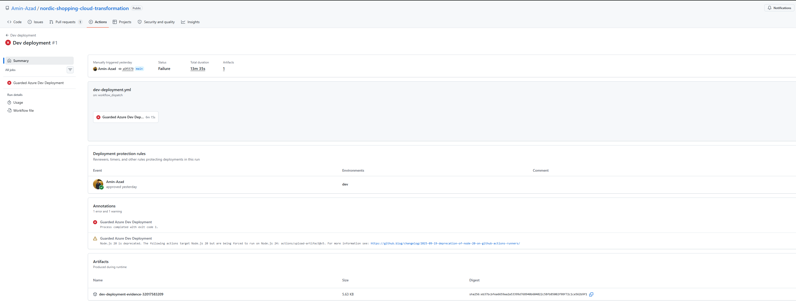
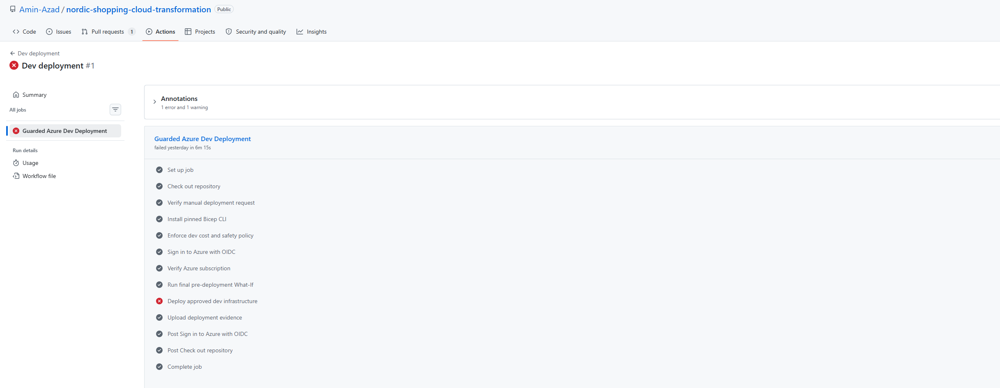

# Deployment Attempt 1 — Failed Safely

## Nordic Shopping guarded development deployment

**Document date:** 17 August 2026
**Environment:** Development (`dev`)
**Previous successful What-If:** `31819819733`
**Failed deployment run:** `32017583209`
**Original commit:** `e0f55793b0df74562d1380ebd0ff5cba7ad21dd4`
**Correction commit:** `d55f4dee24be4ea82d80b87d1124fddd0601203a`
**Correction CI run:** `32048658308` — passed
**Correction PRs:** #5 and #6 — merged
**Final successful What-If:** `32068809230`
**Final qualified commit:** `4b6b3d60340b65d9be4e91b437bbf34b45f4e8ee`

## Executive summary

The first guarded Nordic Shopping dev deployment failed during Azure resource creation. The failure was safe: production was not affected, partial dev resources were removed, all 26 `nshop-dev-*` policy assignments were deleted, no soft-deleted Nordic Shopping Key Vault remained, and the legacy budget was deleted and confirmed absent.

The failure was not a single template mistake. It exposed:

- incorrect property emission for Key Vault purge protection;
- an unsupported Azure OpenAI setting;
- subscription-specific SQL placement restrictions;
- zero App Service VM quota in the originally selected regions;
- an unsuitable guest-user SQL administrator;
- concurrent operations against shared networking resources;
- incomplete pre-flight capability checks;
- the need for separately approved cleanup automation.

The immediate response was deliberately corrective. No deployment retry was made until the identified issues had been corrected, validated in Infrastructure Validation, and re-qualified through a fresh What-If.

## Original dev configuration

| Setting | Attempt 1 value |
| --- | --- |
| Primary | North Europe (`northeurope`) |
| Secondary | Sweden Central (`swedencentral`) |
| SQL | `GP_S_Gen5_1`, capacity 1 |
| App Service | B1, one worker |
| Purge protection | Disabled |
| AI model | Disabled |
| Budget | DKK 1,300 |
| SQL administrator | Amin Azad guest-user object |

## Deployment failures

### 1. Key Vault rejected explicit purge-protection false

The module emitted:

```bicep
enablePurgeProtection: enablePurgeProtection
```

For dev, this became an explicit `false`, which Azure rejected. Enabling purge protection was not acceptable merely to bypass the error because purge protection is irreversible and would obstruct temporary dev cleanup.

**Correction:** the module now emits `enablePurgeProtection: true` only when enabled. When disabled for temporary dev, the property is omitted entirely. Production still compiles with `true`. Dev governance remains audit-only.

### 2. Azure OpenAI rejected dynamic throttling

The S0 account hard-coded:

```bicep
dynamicThrottlingEnabled: true
```

Azure rejected it. The AI account was also being created even though the dev model deployment was disabled.

**Correction:**

- removed `dynamicThrottlingEnabled`;
- added `enableAiServicesAccount` separately from `enableAiModelDeployment`;
- dev disables both the account and model;
- production enables both and keeps private networking;
- AI RBAC is conditional on the account existing.

### 3. North Europe SQL returned ProvisioningDisabled

Azure reported that this subscription was restricted from provisioning SQL in North Europe. This was a subscription placement rule, not general regional unavailability.

**Correction:** actual subscription capability endpoints were queried for the exact SQL SKU in each candidate region. The decision no longer relies only on Azure's general service-location list.

### 4. North Europe App Service B1 quota was zero

Azure reported:

```text
Current Limit (Total VMs): 0
Amount required: 1
```

Although B1 is generally offered in North Europe, this Free Trial subscription could not provision it there.

**Correction:** regional Microsoft.Web usage and exact SKU quota were checked together with SQL availability. P0v4 was selected only in regions where both SQL and App Service were permitted.

### 5. Sweden Central SQL rejected the Entra administrator

The failed deployment used the guest-user object for Amin Azad:

```text
Object type: External guest user
```

**Correction:** both dev and production now use the security group:

```text
Display name: nshop-database-administrators
Object type: Security-enabled group
Security enabled: true
```

The GitHub dev variable `SQL_ENTRA_ADMIN_OBJECT_ID` was updated. Validation requires the compiled SQL administrator ID to equal the database-administrators group ID, and unnecessary identity values are not printed by workflows.

### 6. VNet returned AnotherOperationInProgress

Multiple modules could modify the same VNet or subnet concurrently: subnet deployment, private endpoints, and web-app VNet integrations.

**Correction:**

- ordered application and private-endpoint subnet work;
- serialized private endpoints: Storage, Key Vault, SQL, then optional OpenAI;
- added `@batchSize(1)` to web-app modules so VNet integrations are sequential.

The dependency graph was corrected rather than hiding structural concurrency behind retries.

### 7. Failed subscription deployment left cleanup work

Manual cleanup was initially required for:

- six resource groups;
- 26 `nshop-dev-*` policy assignments;
- `budget-nshop-monthly`;
- deleted-Key-Vault verification.

**Correction:** a strict cleanup script and manual workflow were added with exact `DELETE-DEV` confirmation, protected dev approval, an explicit six-RG allowlist, policy and budget cleanup, deleted-Key-Vault checks, polling, final zero-resource verification, and 90-day evidence.

Cleanup never targets production, bootstrap identities, federated credentials, the custom What-If role, or deployment records. Deployment never invokes cleanup automatically.

## SQL investigation in detail

SQL was the most complex part because fixing only the administrator would not solve the regional restriction, and changing only the region would not solve App Service quota.

### Subscription compatibility table

| Region | SQL GP_S_Gen5_1 | App Service quota | Decision |
| --- | --- | --- | --- |
| North Europe | Restricted | B1/total VM limit 0 | Reject |
| Sweden Central | Available | Total VM limit 0 | Reject |
| West Europe | Restricted | B1/total VM limit 0 | Reject for dev; prod design unchanged |
| Germany West Central | Available | P0v4 limit 10 | Dev primary |
| Norway East | Restricted | P0v4 limit 10 | Reject |
| UK South | Restricted | P0v4 limit 10 | Reject |
| Canada Central | Available | P0v4 limit 10 | Dev secondary |
| Japan East | Available | P0v4 limit 10 | Compatible, not selected |

The subscription is a Free Trial offer with spending limit enabled. General regional availability therefore could not substitute for subscription-specific checks.

### Serverless and failover behavior

`GP_S_Gen5_1` is serverless. The architecture also uses a SQL failover group. Geo-replication and failover groups do not support auto-pause, creating a latent failure that had not yet appeared in attempt 1.

The SQL database module now detects `GP_S_*` and emits:

```bicep
autoPauseDelay: -1
minCapacity: 0.5
```

Provisioned production SQL does not receive serverless properties.

Disabling auto-pause is required for failover but means compute costs continue at the minimum capacity. The corrected dev configuration is therefore intended for short validation and prompt cleanup, not indefinite operation.

## Corrected region and cost decision

### Dev

| Role | Region | Code |
| --- | --- | --- |
| Primary | Germany West Central | `gwc` |
| Secondary | Canada Central | `cac` |

### Production — unchanged

| Role | Region |
| --- | --- |
| Primary | West Europe |
| Secondary | Sweden Central |

The corrected dev App Service SKU is Linux P0v4, one worker in each region. Observed prices were approximately:

- Germany West Central: DKK 0.6225/hour, or DKK 29.88 for 48 hours;
- Canada Central: DKK 0.5746/hour, or DKK 27.58 for 48 hours.

The two App Service plans total about DKK 57.46 for 48 hours. SQL and other services add cost, so the DKK 1,300 limit still requires a short observation window and guarded cleanup.

## Additional safeguards added

### Subscription readiness

`check-dev-subscription-readiness.sh` checks:

- expected subscription and tenant;
- registered resource providers;
- exact SQL SKU availability in both regions;
- App Service P0v4 capacity in both regions;
- SQL administrator name, tenant, group, and object-ID consistency;
- deployment identity roles;
- existing dev resource groups and policies;
- new and legacy budget conflicts;
- live and soft-deleted Key Vault conflicts.

The readiness check passed locally.

### Budget isolation

The ambiguous `budget-nshop-monthly` was replaced by environment-specific naming:

- `budget-nshop-dev-monthly`;
- `budget-nshop-prod-monthly`.

### Workflow behavior

The corrected workflows:

- run readiness before deployment;
- run provider-level ARM validation;
- derive deployment location from compiled dev parameters;
- perform a final What-If and block deletes;
- record source What-If run and commit;
- collect partial-resource evidence on failure;
- provide a cleanup command/link without automatic deletion;
- share a concurrency group between deployment and cleanup;
- retain deployment and cleanup evidence for 90 days.

Artifact upload actions were upgraded from v5 to v7. Two Diagnostic Settings API linter warnings remain tracked and non-blocking; the current resource-scoped schema was retained rather than moving backward merely to silence lint.

## Cleanup evidence after attempt 1

| Target | Confirmed state |
| --- | --- |
| Six partial dev resource groups | Deleted |
| Live dev resources | None |
| 26 dev policies | Deleted |
| Soft-deleted dev Key Vaults | None |
| Legacy budget | Deleted; filtered table empty |
| Deployment record | Retained as audit evidence |
| Production | Unaffected |

The first budget query used an unsupported `--scope` argument in the installed CLI. Listing under the active subscription without that argument confirmed the budget table was empty.

## Validation record

The corrections passed:

- Bicep format and lint;
- root template build;
- dev and production parameter builds;
- dev safety validation;
- Bash syntax and executable-mode checks;
- workflow YAML parsing;
- local subscription readiness;
- cleanup dry run;
- `git diff --check`;
- Infrastructure Validation run `32048658308`.

The correction CI run passed on exact commit:

```text
d55f4dee24be4ea82d80b87d1124fddd0601203a
```

## Corrected dev configuration

| Setting | Corrected value |
| --- | --- |
| Primary | Germany West Central |
| Secondary | Canada Central |
| SQL | GP_S_Gen5_1, capacity 1, minimum 0.5, no auto-pause |
| App Service | Linux P0v4, one worker per region |
| SQL administrator | nshop-database-administrators |
| Purge protection | Omitted in dev; true in prod |
| Locks | Disabled in dev |
| Policy effect | Audit |
| AI account/model | Disabled in dev |
| SQL failover | Manual |
| Budget | DKK 1,300; budget-nshop-dev-monthly |

## Qualification closure

PR #5 was subsequently merged as commit `0b8f95fe2b68150b772e96a8c899b67d1fd8d4b1`. Main-branch Infrastructure Validation run `32062902860` passed.

The first replacement What-If, run `32063339668`, safely exposed one additional issue: the retained attempt-1 subscription deployment records were location-bound to North Europe. Three fixed nested deployment names could not be reused in Germany West Central. No resources were created.

PR #6 added the primary region code to the resource-group, policy-assignment, and budget deployment names and added a readiness guard for incompatible deployment-record locations. It was merged as commit `4b6b3d60340b65d9be4e91b437bbf34b45f4e8ee`. Main Infrastructure Validation run `32068117649` passed.

The final replacement Dev What-If succeeded:

- run: `32068809230`;
- commit: `4b6b3d60340b65d9be4e91b437bbf34b45f4e8ee`;
- result: 54 visible resources to create;
- destructive changes: none;
- Azure errors: none;
- old regions: absent;
- new budget: `budget-nshop-dev-monthly`;
- policies: audit-only;
- AI Services account: absent as intended.

Azure reported 20 non-fatal What-If expansion diagnostics: ten nested deployments were short-circuited because parameters contained runtime references, and ten were skipped from internal expansion because Azure processes nested expansion in batches of ten. These are What-If visibility limitations, not deployment errors. The compiled templates, parameter validation, subscription readiness, provider checks, and CI results provide complementary validation for those nested resources.

The correction and readiness work is complete. A real deployment remains a separately approved activity.

## Evidence

- [Failed deployment run 32017583209](https://github.com/Amin-Azad/nordic-shopping-cloud-transformation/actions/runs/32017583209)
- [Correction CI run 32048658308](https://github.com/Amin-Azad/nordic-shopping-cloud-transformation/actions/runs/32048658308)
- [Final qualified What-If run 32068809230](https://github.com/Amin-Azad/nordic-shopping-cloud-transformation/actions/runs/32068809230)
- [Attempt 2 controlled-failure record](deployment-attempt-2-controlled-failure.md)





## Conclusion

Attempt 1 failed within a guarded process and caused no production impact. It exposed subscription placement restrictions, quota limitations, administrator suitability, serverless failover behaviour, shared-network concurrency, and incomplete cleanup coverage.

The resulting corrections were validated through CI and a fresh guarded What-If. Attempt 2 was performed later and is documented separately; it identified additional subscription-quota and SQL deployment issues without affecting production.
