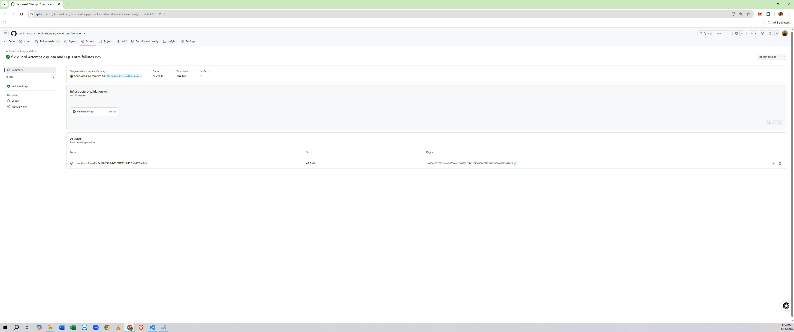
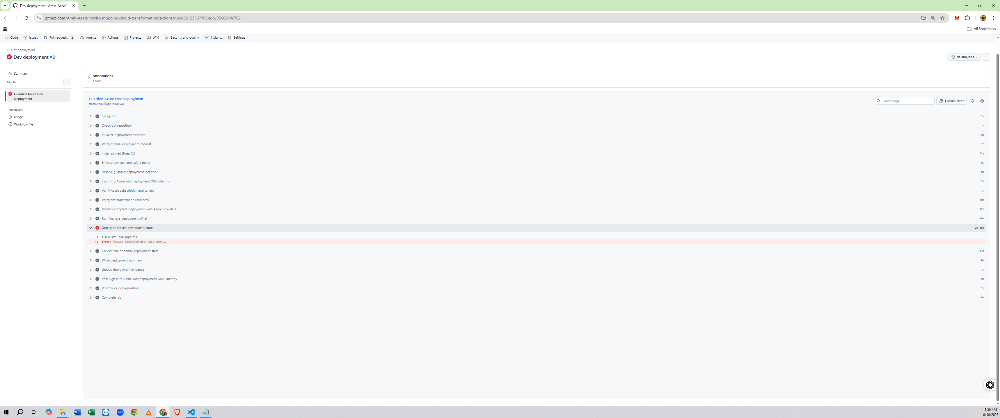
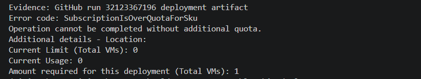
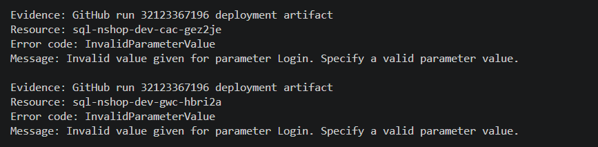
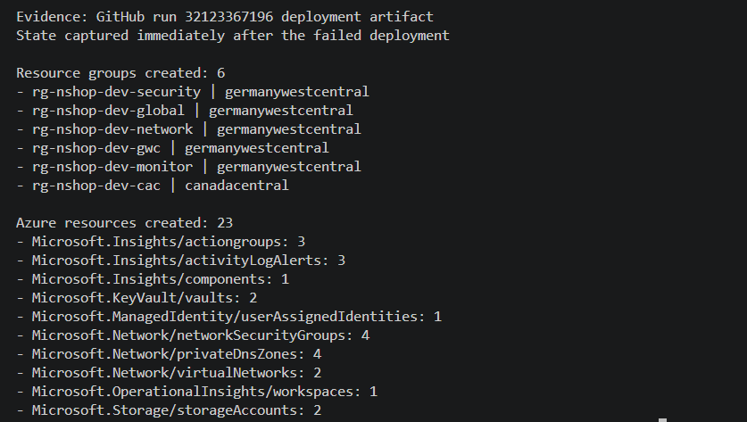
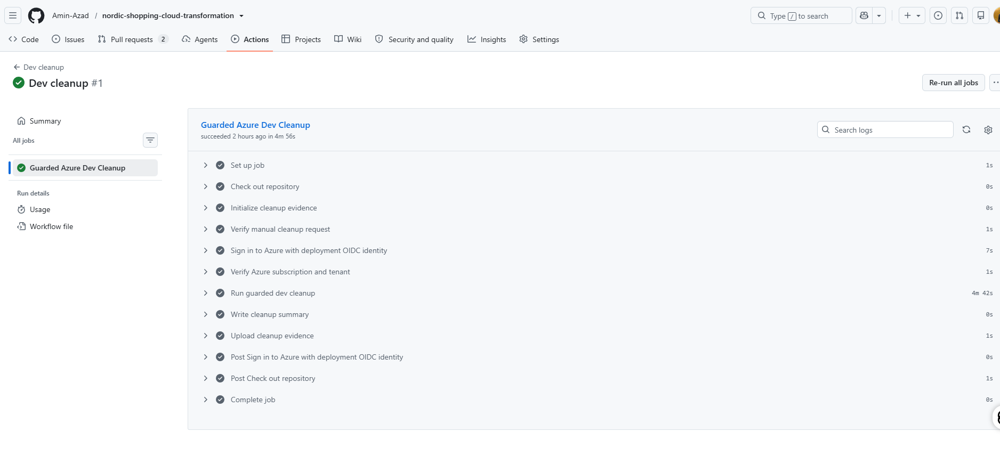
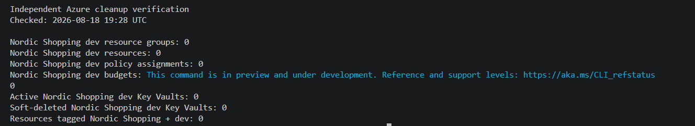
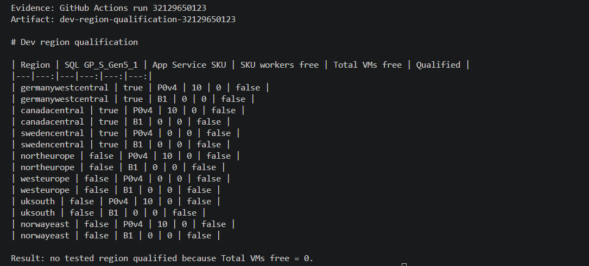
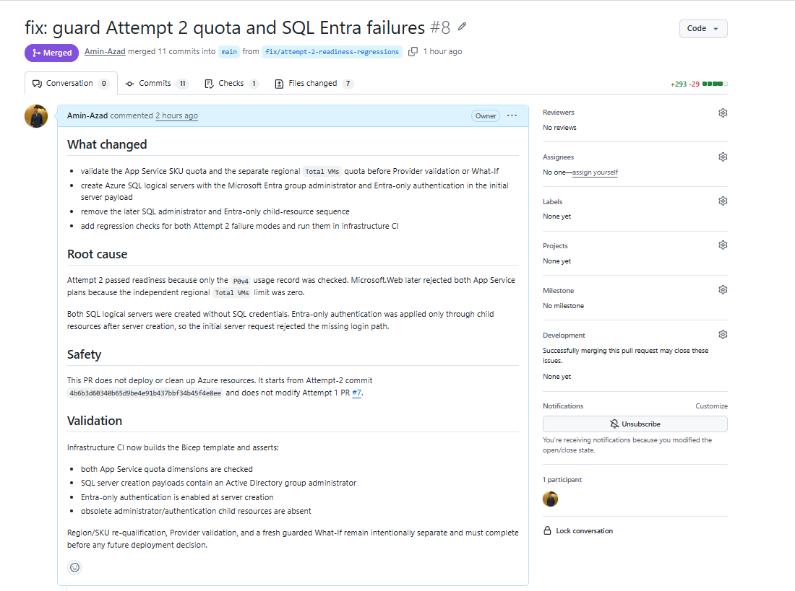

# Attempt 2 evidence

The written record is in
[the Attempt 2 report](../../deployment-attempts/deployment-attempt-2-controlled-failure.md).

## Primary records

| Evidence | Result |
|---|---|
| [Guarded deployment run 32123367196](https://github.com/Amin-Azad/nordic-shopping-cloud-transformation/actions/runs/32123367196) | Failed during resource creation after the preceding gates passed |
| Deployment artifact `dev-deployment-evidence-32123367196` | Uploaded by the deployment workflow |
| [Guarded cleanup run 32124949474](https://github.com/Amin-Azad/nordic-shopping-cloud-transformation/actions/runs/32124949474) | Passed |
| Cleanup artifact `dev-cleanup-evidence-32124949474` | Uploaded by the cleanup workflow |
| [Correction PR #8](https://github.com/Amin-Azad/nordic-shopping-cloud-transformation/pull/8) | Merged |
| [Correction CI run 32127953187](https://github.com/Amin-Azad/nordic-shopping-cloud-transformation/actions/runs/32127953187) | Passed |
| [Region qualification 32129650123](https://github.com/Amin-Azad/nordic-shopping-cloud-transformation/actions/runs/32129650123) | Stopped because no tested region qualified |

The workflow runs and retained artifacts are the primary records. The screenshots
below are selected summaries. Terminal screenshots contain only fields extracted
from those artifacts or read-only Azure CLI results.

## Visual record

### 1. Correction CI passed

Bicep formatting, lint, build, parameter compilation and Attempt 2 regression
checks completed successfully.

### 2. Deployment reached resource creation

OIDC authentication, subscription checks, Provider validation and final What-If
passed before the resource-creation step failed.

### 3. App Service quota failure

The deployment artifact records a regional `Total VMs` limit of zero and one
worker required.

### 4. SQL Entra administrator failure

The same artifact records `InvalidParameterValue` for the administrator
`Login` value on both regional SQL servers.

### 5. Partial deployment state

The post-failure evidence captured six resource groups and 23 Azure resources.

### 6. Guarded cleanup passed

The separately confirmed cleanup workflow completed successfully and uploaded
its evidence artifact.

### 7. Independent cleanup verification

Read-only Azure CLI checks found no remaining project dev resource groups,
resources, policies, budgets, active or soft-deleted Key Vaults, or tagged
resources.

### 8. Region qualification stopped

All seven tested regions reported zero available `Total VMs` capacity for the
subscription, so no region qualified.

### 9. Corrective changes merged

PR #8 added the quota checks, SQL administrator correction, region qualification
and regression coverage.

## Capture notes

The capture and redaction criteria are recorded in
[`CAPTURE-CHECKLIST.md`](CAPTURE-CHECKLIST.md). The walkthrough outline is in
[`VIDEO-NOTES.md`](VIDEO-NOTES.md).

Complete raw logs are not copied into this repository because they may contain
account metadata and are less useful than the retained workflow records.
