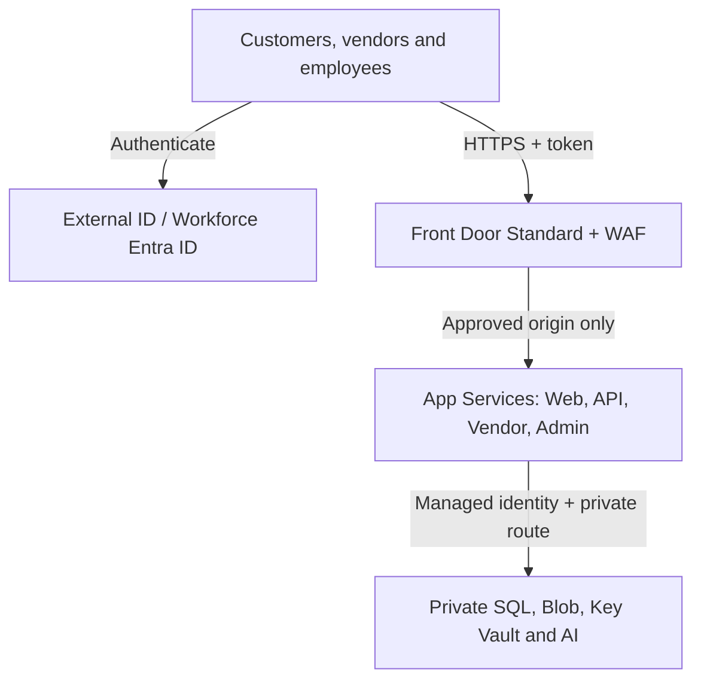

# Nordic Shopping Cloud Transformation — Security Strategy

| Item | Approved value |
|---|---|
| Company | Nordic Shopping |
| Document | Security Strategy and Technical Control Design |
| Owner | Amin Azad |
| Version | Final V6 |
| Status | Implementation source of truth |
| Date | 4 August 2026 |
| First issued | 30 July 2026 |
| Primary region | West Europe (`westeurope`) |
| DR region | Sweden Central (`swedencentral`) |
| Architecture model | Active–passive managed Azure PaaS |
| Related documents | `docs/architecture/04-target-architecture.md`, `docs/security/07-security-assessment.md` |

## 1. Purpose

This document defines how Nordic Shopping will implement, operate and verify security for the Azure target architecture. The security assessment identifies risks; this strategy converts those risks into technical controls, named responsibilities, deployment gates and measurable evidence.

The strategy applies to the Customer Web, Nordic API, Vendor Portal, Admin Portal, mobile API clients, Azure platform services, GitHub delivery pipelines, external providers and the AI Operations Assistant. Version 2 adds an explicit threat-and-attack defence model that maps realistic attacks to prevention, detection, response, recovery and test evidence. Production cutover is prohibited until every mandatory control in Section 21 has passed.

## 2. Security position

Nordic Shopping will use a zero-trust, defense-in-depth model:

1. Verify every user, workload and deployment identity.
2. Grant the minimum permission for the minimum necessary duration.
3. Treat every network, device, token, payload and external integration as potentially hostile.
4. Require both connectivity and authorization; neither one replaces the other.
5. Keep the Nordic API as the only business and data-access boundary.
6. Expose applications through Front Door only; data services remain private.
7. Build controls through Bicep and protected pipelines to reduce configuration drift.
8. Collect sufficient evidence to detect, investigate and recover from attacks.
9. Preserve the same security posture during regional recovery.
10. Keep the AI assistant read-only, isolated and non-critical to commerce.

Security follows the shared-responsibility model. Azure protects the underlying cloud platform; Nordic Shopping remains responsible for identity, application code, authorization, configuration, data, logging, provider integrations and incident response.

## 3. Security architecture



The runtime control path is:

```text
Client → identity provider → signed token → Front Door/WAF
→ origin restriction → application authentication → object/action authorization
→ managed identity → private DNS/private endpoint → service-side RBAC or SQL permission
```

WAF is associated with Front Door; it is not a separate network hop. Front Door connects to each App Service origin, never to the App Service Plan. Portals and mobile clients call the Nordic API and never connect directly to SQL, Storage, Key Vault or Azure OpenAI.

## 4. Security ownership and separation of duties

| Role | Main responsibility | Must not do alone |
|---|---|---|
| Executive risk owner | Accept residual risk and approve exceptions | Implement or self-approve technical controls |
| Security owner | Security baseline, findings, incident oversight | Deploy unreviewed production code |
| Identity owner | Entra tenants, groups, Conditional Access, access reviews | Approve own permanent privileged access |
| Platform owner | Azure networking, PaaS configuration, Policy and Defender | Activate DR without incident authorization |
| Application owner | Authentication, authorization and secure code | Grant Azure subscription roles |
| DevOps owner | OIDC, workflows, artifacts and deployment evidence | Bypass protected production approval |
| Data owner/DPO | Classification, retention, GDPR and exports | Give broad data access without business justification |
| Incident commander | Declare incidents and coordinate recovery | Quietly accept unresolved security impact |
| DR owner | Replication tests, failover and failback evidence | Activate public DR traffic without approval |

Azure roles are assigned to Entra groups rather than individuals. Production deployment approval, privileged identity activation and DR activation must be attributable to named people.

## 5. Identity and access strategy

### 5.1 Identity boundaries

| Identity | Tenant/model | Technical controls |
|---|---|---|
| Customers | Entra External ID external tenant | Dedicated app registrations, secure sign-up/sign-in, verified recovery, token validation, abuse monitoring |
| Vendors | Workforce Entra B2B guests | Invitation approval, MFA, terms of use, vendor group/membership, quarterly review, expiry/offboarding |
| Employees | Workforce Entra ID | MFA, Conditional Access, group roles, device/risk controls where licensed, quarterly review |
| Azure workloads | System-assigned managed identity per app | No application credentials; narrow data-plane roles |
| GitHub Actions | Entra federated workload identity | Repository/environment-bound OIDC; short-lived Azure token |
| Emergency access | Two cloud-only break-glass accounts | Strong independent authentication, exclusion only where necessary, monitoring and tested recovery procedure |

Customer accounts remain outside the workforce directory. A B2B guest is not an employee and receives no access until assigned to an approved vendor membership and application role.

### 5.2 Workforce controls

- Require MFA for all employees, vendors and privileged administration.
- Block legacy authentication.
- Require compliant or approved devices for privileged administration when licensing and device management are available.
- Use Conditional Access to restrict high-risk sign-ins and require stronger controls for administrators.
- Use Privileged Identity Management for eligible, time-bound Azure and Entra roles where licensed.
- Alert on role changes, Conditional Access changes, failed MFA, risky sign-ins and break-glass use.
- Review privileged access monthly; review all employee and vendor access quarterly.
- Disable employee access immediately on departure and expire vendor access at the end of the contract or approved review period.

### 5.3 Azure RBAC model

| Group/identity | Scope | Allowed access |
|---|---|---|
| `grp-nshop-prod-readers` | Production resource groups | Reader only |
| `grp-nshop-prod-operators` | Production workload | Monitoring and approved operational actions; no role assignment |
| `grp-nshop-prod-deploy-approvers` | GitHub production environment | Approve release after staging evidence |
| `grp-nshop-security` | Subscription/security resources | Security Reader plus approved Defender/Policy management |
| Pipeline infrastructure identity | Defined deployment resource groups | Resource deployment only; no self-service role elevation |
| API managed identity | Required services only | SQL application permissions, Blob container roles, Key Vault Secrets User, AI invocation in WEU |
| Portal managed identities | Own application dependencies only | No SQL, Blob or Key Vault business-data access |

Subscription Owner and User Access Administrator are emergency roles, not daily roles. Role-assignment deployment should use a separately controlled identity if the main pipeline does not require it.

### 5.4 API authentication and authorization

For every protected request, the API validates:

- signature against the trusted issuer's current keys;
- exact issuer and audience;
- expiry, not-before and required scopes;
- application role and allowed action;
- customer/vendor/employee identity type;
- vendor membership or employee role from a trusted server-side source;
- record ownership and object-level access.

The API must not trust a `vendorId`, `customerId`, price, refund permission or role supplied only by the client. Vendor context is derived from validated identity and authoritative membership. Automated tests must attempt cross-vendor read, update, delete, export and order actions.

High-impact operations—refunds, vendor approval, bulk export, privilege changes and DR activation—require dedicated roles, strong audit events and separation of duties where practical.

## 6. Edge and internet security

### 6.1 Front Door baseline

- Azure Front Door Standard is the only public ingress.
- Four HTTPS-only domains/routes map independently to Customer Web, Nordic API, Vendor Portal and Admin Portal.
- Redirect HTTP to HTTPS and use managed certificates.
- Minimum origin TLS is 1.2 or the highest mutually supported baseline.
- Do not cache API responses, authenticated pages, admin responses or responses containing personal data.
- Enable caching for public static content only through explicit cache headers.
- Use `/health/ready` probes that return `200` only when mandatory regional dependencies are ready.
- Keep SWC API traffic disabled or unready until SQL promotion and authorized DR validation.

### 6.2 WAF technical baseline

Front Door Standard uses custom WAF rules. The policy runs in detection mode during tuning and must be in prevention mode before go-live.

| Priority | Rule | Initial action |
|---:|---|---|
| 100 | Emergency malicious IP/range deny list | Block |
| 110 | Admin geographic/IP restriction when business-approved | Block |
| 120 | Deny unnecessary methods such as `TRACE` and `TRACK` | Block |
| 130 | Enforce request-body and upload limits | Block |
| 200 | Anonymous API rate limit by source socket IP | Rate limit |
| 210 | Stricter login, reset and registration rate limit | Rate limit |
| 220 | Strict admin endpoint rate limit | Rate limit |
| 230 | Provider-specific webhook path limits | Rate limit/Log |

Thresholds are derived from load testing and two weeks of representative detection-mode telemetry. Every rule has an owner, purpose, exclusion justification and false-positive test. Emergency exceptions expire automatically or receive weekly review.

Upgrade to Front Door Premium when managed WAF rules, bot protection, Private Link origins or stronger edge compliance becomes a business requirement, or when the custom-rule posture no longer treats observed threats adequately.

### 6.3 Origin lock-down

For the main site of every App Service:

1. allow the `AzureFrontDoor.Backend` service tag;
2. require `X-Azure-FDID` to equal the approved Front Door profile ID;
3. deny all unmatched traffic;
4. preserve authentication and authorization at the application layer.

For each SCM/Kudu endpoint:

- default deny;
- permit only the approved deployment path;
- disable basic publishing credentials where supported by the delivery method;
- disable FTP/FTPS.

Automated tests must prove that the `azurewebsites.net` hostname, a missing/incorrect Front Door ID and unauthorized SCM access are rejected.

### 6.4 Browser/API controls

- HSTS with a staged, tested maximum age; include subdomains only after validation.
- Content-Security-Policy with explicit sources and no unsafe exceptions unless risk-approved.
- `X-Content-Type-Options: nosniff`, frame protection through CSP, and restrictive `Referrer-Policy`.
- Cookies marked `Secure`, `HttpOnly` and an appropriate `SameSite` value.
- CSRF protection for cookie-authenticated state changes.
- CORS allow-list containing exact approved origins; no credentialed wildcard.
- JSON/content-type enforcement, request-size limits and schema validation.
- Generic external error responses; correlation IDs for internal investigation.

## 7. Application security strategy

Engineering will use a secure software-development lifecycle:

1. Threat-model authentication, vendor isolation, checkout, payment, refunds, exports, webhooks, uploads, AI and DR flows.
2. Define security acceptance criteria before implementation.
3. Use peer review and protected branches.
4. Run static analysis, dependency, secret and infrastructure scanning on pull requests.
5. Use parameterized database access, centralized authorization middleware and output encoding.
6. Deploy one immutable artifact to both regions.
7. Test in staging, approve using evidence and swap only after tests pass.
8. Perform authenticated dynamic testing and penetration testing before first production release and after material trust-boundary changes.

### 7.1 Required coding controls

- No string-built SQL queries from untrusted values.
- No authorization decisions based only on UI visibility.
- No secrets, access tokens, personal data, full request bodies or payment details in logs.
- Idempotency keys and server-side deduplication for order, payment and fulfilment operations.
- Bounded timeouts, retries with jitter and circuit breakers for external calls.
- Durable sessions, files, locks and background state must not use App Service local storage.
- Sensitive exports require explicit permission, volume limits, audit and secure expiry.
- Dependencies have owners and patch deadlines: critical exposure 48 hours, high exposure 7 days unless a documented mitigation is accepted.

### 7.2 File-upload pattern

Direct public Blob uploads are outside release 1. Before uploads are enabled:

- authorize the upload through the API;
- restrict size, count, extension and detected content type;
- store in a private quarantine container;
- scan for malware and active content;
- move only approved objects to the serving container;
- serve with safe content disposition and from a non-trusted execution origin where needed;
- record uploader, hash, scan outcome and retention class.

## 8. Network and private-access strategy

### 8.1 Regional boundaries

| Region | VNet | Integration subnet | Private endpoint subnet |
|---|---|---|---|
| West Europe | `10.10.0.0/16` | `10.10.1.0/24` | `10.10.2.0/24` |
| Sweden Central | `10.20.0.0/16` | `10.20.1.0/24` | `10.20.2.0/24` |

The integration subnet is delegated only to `Microsoft.Web/serverFarms`. Private endpoints reside only in the private-endpoint subnet. App Services use regional VNet integration and `WEBSITE_VNET_ROUTE_ALL=1`.

### 8.2 Private service path

```text
Nordic API → VNet integration → private DNS resolution
→ service private endpoint → service authorization → data
```

| Service | WEU | SWC | Public network |
|---|---|---|---|
| Azure SQL | Private endpoint and SQL DNS zone | Private endpoint and SQL DNS zone | Disabled |
| Blob Storage | Private endpoint and Blob DNS zone | Private endpoint and Blob DNS zone | Disabled |
| Key Vault | Private endpoint and Vault DNS zone | Private endpoint and Vault DNS zone | Disabled |
| Azure OpenAI | Private endpoint and OpenAI DNS zone | Not deployed in release 1 | Disabled |

The corrected DR design uses three private DNS zones in Sweden Central. The OpenAI zone is linked only where its private endpoint is consumed. AI must fail closed and remain unavailable during DR rather than becoming public.

### 8.3 NSG and egress policy

- Integration subnet: no public ingress; allow required outbound HTTPS to private endpoints, Azure platform dependencies and approved provider endpoints.
- Private-endpoint subnet: allow required VNet sources and platform response traffic; configure private-endpoint network policies according to tested routing/security requirements.
- Do not introduce blanket deny rules until DNS, service tags, App Service platform behavior and recovery access are validated.
- Review Azure Firewall or NAT Gateway when stable provider source IPs, FQDN filtering, centralized egress inspection or regulatory controls are required.
- Until controlled egress is introduced, compensate with provider allow-listing where available, strict TLS, scoped credentials, timeouts, monitoring and application-layer destination configuration.

## 9. Data protection strategy

### 9.1 Classification

| Class | Examples | Enforcement |
|---|---|---|
| Public | Catalogue, public prices | Integrity and approved publication controls |
| Internal | Runbooks, non-sensitive metrics | Workforce access; no public sharing by default |
| Confidential | Orders, addresses, vendor records, support data | Private services, least privilege, encryption, retention and audit |
| Restricted | Tokens, reset material, secrets, payment references | Never log; identity platform/Key Vault; minimal access and retention |

Production data must not enter non-production unless irreversibly masked and approved by the data owner.

### 9.2 Azure SQL

- Public network access disabled; private endpoint in each region.
- Entra administrator and managed-identity access where supported; avoid runtime SQL passwords.
- Separate runtime and schema-migration permissions.
- Runtime identity receives only required stored procedure/table permissions.
- Transparent Data Encryption and TLS connections enabled.
- SQL auditing and Defender findings sent to the approved central evidence destination.
- Parameterized access and field-level data minimization.
- Point-in-time restore and failover-group recovery tested separately.
- Backward-compatible migrations during slot releases; destructive changes require explicit approval and restore evidence.

### 9.3 Blob Storage

- Disable public Blob access and public network access.
- Disable shared-key authorization after operational validation; use Entra/managed identity.
- Assign roles at container scope where practical.
- Enable versioning, soft delete and lifecycle policies aligned to the data class.
- Replicate approved critical objects only; object replication is not a backup.
- Enable diagnostic logs for authorization failures, delete operations and unusual access.

### 9.4 Key Vault and secret lifecycle

- One independent private vault per region with RBAC, soft delete and purge protection.
- No automatic secret replication is assumed.
- Use managed identity and Key Vault references/runtime retrieval.
- Grant the API `Key Vault Secrets User` only on the required vault; separate secret administration.
- Never place secret values in Bicep files, parameter files, GitHub variables, workflow output, tickets or logs.
- Provider secrets have a named owner, expiry alert and tested rotation procedure.
- Provision required DR secrets through a controlled process and verify them in quarterly DR readiness checks.

Platform-managed encryption is the release-1 baseline. Customer-managed keys require a separate design covering key availability, rotation, recovery and separation of duties.

## 10. External-provider security

Outbound payment, email, SMS and delivery integrations use TLS, scoped credentials from Key Vault, short timeouts, bounded retries, circuit breakers, idempotency and reconciliation. Full payment-card data and CVV are never stored or logged by Nordic Shopping.

Inbound webhooks must enter through the Front Door API route. Processing order:

1. preserve the raw body required for signature verification;
2. verify provider signature with constant-time comparison where applicable;
3. validate timestamp tolerance and reject replay;
4. validate provider account, event type and schema;
5. deduplicate using the provider event ID;
6. enqueue or process idempotently and return a non-sensitive response;
7. log correlation ID, event ID, verification outcome and final status;
8. reconcile with provider state for missed or out-of-order events.

IP allow-listing is supplementary and never replaces cryptographic signature verification when the provider supports signatures.

## 11. Secure CI/CD and infrastructure strategy

### 11.1 GitHub controls

- Require pull requests, peer approval, status checks and protected default/release branches.
- Protect the production environment with named approvers.
- Route workflow changes to the repository owner through CODEOWNERS; branch protection determines whether that review is mandatory.
- Pin third-party actions to reviewed commit SHAs.
- Grant the workflow token minimum permissions; default to read-only.
- Prevent untrusted fork code from receiving production permissions.
- Enable secret scanning and dependency alerting.

### 11.2 OIDC federation

GitHub Actions requests a GitHub-issued OIDC token and exchanges it with the Entra workload identity for a short-lived Azure access token. No Azure client secret is stored in GitHub.

Federated credentials are restricted by:

- expected issuer `https://token.actions.githubusercontent.com`;
- expected Azure audience;
- exact GitHub organization and repository;
- protected environment subject for production;
- separate identities for non-production and production.

The pipeline may deploy approved resources but cannot grant itself roles, read application secrets, declare a disaster or activate Front Door DR origins.

### 11.3 Release security gates

```text
Pull request → review and scans → build immutable artifact
→ deploy WEU/SWC staging → warm-up and smoke/security tests
→ human approval with evidence → production slot swaps
→ post-deployment validation
```

Required checks include unit/integration tests, dependency and secret scanning, Bicep lint/validation, `what-if` review, staging health, authentication, authorization, direct-origin denial and critical business smoke tests. Swap-back is permitted only when database/configuration changes remain compatible.

### 11.4 Bicep and Azure Policy guardrails

The Bicep baseline must declare security settings explicitly rather than rely on portal defaults. Policy initiatives should audit first, then deny after remediation and impact testing.

| Guardrail | Intended effect |
|---|---|
| Allowed locations | Permit West Europe, Sweden Central and approved global services |
| Required tags | Enforce owner, environment, classification, criticality and management source |
| Secure transport | Require HTTPS/TLS and secure transfer |
| Public PaaS access | Deny public SQL, Storage, Key Vault and Azure OpenAI access |
| Storage public access | Deny anonymous Blob access |
| Key Vault protection | Require RBAC, soft delete and purge protection |
| Diagnostic settings | Audit required logs routed to central monitoring |
| Managed identity | Audit workloads that should not use stored credentials |
| Defender plans | Audit approved Defender coverage |

Exceptions require owner, reason, risk, compensating control and expiry date. Portal changes are treated as temporary emergency actions and must be reconciled into Bicep or reverted after the incident.

## 12. Security monitoring and detection

### 12.1 Telemetry sources

| Source | Required security evidence |
|---|---|
| Entra | Sign-ins, risk, MFA/Conditional Access, directory audit and role changes |
| Front Door/WAF | Requests, rule actions, rate limits, origin health and anomalies |
| App Services/API | Auth failures, authorization denials, administrative actions, errors and correlation IDs |
| Azure SQL | Audit, threat findings, authentication and unusual access |
| Storage | Authorization failures, delete/write anomalies and configuration change |
| Key Vault | Secret access/denial, deletion, purge and policy/RBAC change |
| Azure Activity Log | Deployments, role assignments, Policy and network/security configuration |
| GitHub | Workflow, approval, branch protection, environment and OIDC evidence |
| DR | Replication health, promotion, scaling and Front Door origin changes |
| AI | Approved user, source set, consumption and advisory outcome—without sensitive prompt logging |

Application Insights uses the central Log Analytics workspace. Use UTC timestamps, a request/correlation ID and distinct cloud role names. Redact before ingestion. Access to logs is group-based and audited because telemetry may contain confidential operational context.

### 12.2 Minimum alert set

| Severity | Detection | Response target |
|---|---|---|
| Critical | Privileged compromise, destructive Key Vault/data action, confirmed breach, unauthorized DR activation | Immediate paging and incident declaration |
| High | Repeated admin failures, privilege/federation change, cross-vendor attempt, severe WAF/API attack, replication failure | Page primary responder; rapid triage |
| Medium | Elevated 401/403/429, unusual export, provider signature failures, public-access drift, security scan regression | Queue with owner and SLA |
| Low | Informational control changes and tuning signals | Review during operations cycle |

Every alert has an owner, query/signal, threshold, action group, runbook link and test record. Primary and secondary responders receive critical alerts. Noise is tuned monthly without suppressing true positives.

### 12.3 Defender for Cloud

Enable Defender for Cloud posture management and the workload protection plans approved by the cost model. Review recommendations weekly during implementation and monthly in operation. Critical/high findings enter the tracked risk backlog; exemptions require documented compensating controls and expiry.

## 13. Incident-response strategy

The operational lifecycle is: prepare → detect → triage → contain → eradicate → recover → communicate → learn.

Minimum runbooks:

- account takeover or privileged identity compromise;
- vendor cross-tenant access attempt;
- public endpoint or secret exposure;
- malicious deployment/supply-chain compromise;
- payment/provider webhook fraud;
- data exfiltration or destructive operation;
- denial-of-service/WAF event;
- regional outage and secure DR activation;
- AI data leakage or prompt-injection event.

Containment actions must be pre-authorized by role, logged and reversible where possible. Preserve logs, deployment artifacts, hashes, affected identities, timelines and decisions. The DPO assesses personal-data impact and applicable notification obligations. A post-incident review produces owned actions and deadlines; the AI assistant may summarize evidence but cannot contain, close or remediate incidents.

## 14. AI Operations Assistant security

The AI assistant is an employee-only, read-only feature hosted through the WEU private endpoint. It is not in the checkout or order-processing path and is unavailable during DR release 1.

Controls:

- API-mediated access using employee roles; no direct user-to-model access.
- Approved operational sources only and least-privilege retrieval.
- Redact secrets, tokens, personal data, payment references and unnecessary payloads before model submission.
- Treat logs, tickets and retrieved text as untrusted content that cannot override system policy.
- Separate instructions from retrieved content and restrict tools/data sources server-side.
- Label responses as advisory, show source/time context and allow human verification.
- Record user, time, approved source references, model deployment and outcome without retaining sensitive prompt content unnecessarily.
- Rate/usage limits, cost anomaly alert and kill switch.
- No deployments, refunds, account changes, incident closure, provider actions or DR activation.

Failure or disablement of the assistant must not affect customer, vendor, ordering, payment or recovery services.

## 15. Privacy and GDPR strategy

Before go-live, the data owner and DPO must complete a data inventory and processing register covering category, purpose, lawful basis, subject, owner, processor, region, retention and deletion behavior.

Required processes:

- privacy by default and collection minimization;
- data-processing agreements and international-transfer review;
- access, correction, deletion and portability requests;
- restricted, auditable administrative exports;
- separate retention schedules for commerce, finance, support, identity, audit and telemetry;
- masked or synthetic non-production data;
- backup/replica-aware deletion explanation;
- personal-data breach assessment and notification workflow.

The 30-day Log Analytics interactive baseline is reviewed against operational, legal and security evidence needs. Longer retention uses an approved lower-cost retention method and is reflected in the cost model.

## 16. Backup and DR security

Security is not relaxed during recovery. Sweden Central must have current application artifacts, role assignments, three private DNS zones, SQL/Blob/Key Vault private endpoints, monitoring and independently maintained secrets.

Authorized recovery sequence:

1. Incident commander declares the disaster and freezes changes.
2. Operations and security verify incident scope, replication and identity access.
3. Named privileged operator promotes the SQL secondary after approval.
4. Validate private DNS, endpoints, secrets, certificates, provider credentials, logging and authorization.
5. Confirm Sweden Central's standing two-worker capacity is healthy — no scale-up action is required, since both regions run a standing minimum of two workers.
6. Run authentication, vendor-isolation, data, provider and security smoke tests.
7. Authorized operator enables the matching Front Door DR origins.
8. Monitor and reconcile data while recording every decision.

CI/CD deploys version parity but cannot declare or activate DR. RPO is **15 minutes or less** and RTO is **60 minutes or less**, subject to test evidence. Quarterly readiness checks and at least two full recovery exercises per year must verify these objectives without disabling MFA, WAF, origin protection, private networking or audit.

Failback is a new controlled change: repair WEU, reverse/restore replication safely, reconcile data, validate the full security baseline, approve traffic movement and monitor. Availability of WEU alone is not sufficient reason to fail back.

## 17. Vulnerability and configuration management

| Activity | Frequency/trigger | Evidence |
|---|---|---|
| Dependency and secret scan | Every pull request and scheduled daily/weekly scan | Pipeline result and remediation ticket |
| Bicep/Policy compliance | Every deployment and daily compliance evaluation | `what-if`, deployment and Policy reports |
| External vulnerability scan | Monthly and after material edge changes | Scan report and exceptions |
| Authenticated application scan | Before release and after material application changes | Test report |
| Penetration test | Before first go-live, annually and after major trust-boundary change | Independent report and retest |
| Access review | Privileged monthly; all workforce/vendor quarterly | Review record and removals |
| DR secret/readiness validation | Quarterly | Checklist and test result |
| Restore/failover exercise | At least twice yearly | RPO/RTO and security evidence |

Critical and high findings block production unless the executive risk owner accepts a time-bound exception with compensating controls. Internet-exploitable critical findings receive immediate triage and a 48-hour target; high findings use a 7-day target unless risk-based policy sets a shorter deadline.

## 18. Threat and attack defence model

### 18.1 Method and risk scale

The model follows this chain for each scenario:

```text
Threat actor → attack path → preventive controls → detection
→ containment/response → recovery → evidence → residual risk
```

Risk is rated after planned controls: **Low**, **Medium**, **High** or **Critical**. A control is not considered implemented without technical evidence. Critical and High residual risks block go-live unless the executive risk owner records a time-limited exception, compensating controls, owner and expiry date.

### 18.2 Identity and session attacks

| ID | Attack and likely path | Prevention | Detection | Response and recovery | Required evidence | Owner / residual risk |
|---|---|---|---|---|---|---|
| T01 | Credential stuffing against customer sign-in using breached password lists | External ID controls; endpoint rate limits; progressive delay/lockout; verified recovery; bot challenge when available; prohibit password disclosure | Failed-sign-in spikes; repeated usernames/IPs; WAF 429s; risk events | Rate-limit/block sources; protect affected accounts; revoke sessions; require recovery; notify users when warranted | Automated rate-limit test; sign-in alert test; account-recovery test | Identity + Security / Medium |
| T02 | Brute-force or password-spray against employees/vendors/admins | MFA; block legacy auth; Conditional Access; privileged roles through PIM; admin path restrictions | Entra risky sign-ins; failed MFA; one source targeting many accounts; break-glass use | Block sign-in; disable account; revoke sessions; reset credentials/MFA; investigate role activity | CA policy test; simulated password spray; alert/runbook record | Identity / Low |
| T03 | Phishing, token theft or session replay | Phishing-resistant MFA for privileged users when available; short token lifetime; secure cookies; issuer/audience/lifetime validation; device/risk policy | Impossible travel/risk; unusual token use; new device/location; anomalous admin action | Revoke sessions; disable identity; remove active roles; rotate affected credentials; review actions and data access | Token-negative tests; session-revocation drill; sign-in investigation evidence | Identity + Application / Medium |
| T04 | Privilege escalation through role assignment or compromised administrator | Least privilege; group roles; PIM; separation of duties; pipeline cannot self-assign roles; protected Conditional Access | Entra/Azure Activity alerts for role, federation and CA changes | Remove assignment; disable identity; revoke sessions; restore known policy; investigate downstream actions | Unauthorized-role test; monthly privileged review; alert proof | Identity + Security / Medium |
| T05 | Broken access control/IDOR exposes another customer or vendor's object | Server-side object/action authorization; derive vendor/customer context from trusted identity; never trust client IDs; scoped queries | Authorization-denial spikes; cross-tenant canary tests; unusual enumeration pattern | Disable affected endpoint/account; contain exports; correct logic; assess disclosure; notify under incident/privacy process | Automated cross-vendor read/write/delete/export negative tests | Application + Data / Medium |

### 18.3 Edge, availability and network attacks

| ID | Attack and likely path | Prevention | Detection | Response and recovery | Required evidence | Owner / residual risk |
|---|---|---|---|---|---|---|
| T06 | Volumetric or application-layer DDoS against public domains/API | Azure Front Door edge platform protection; caching of public static data; WAF custom rate limits; bounded request sizes; App Service autoscale; circuit breakers | Front Door request/429/5xx/latency and origin-health anomalies; App Service CPU/memory/queue alerts | Activate stricter emergency rules/IP blocks; protect expensive endpoints; scale within approved limit; engage Azure support; preserve evidence | Load/rate-limit test; alert and emergency-rule exercise | Platform + Incident commander / Medium |
| T07 | Bot scraping, inventory abuse, fake registrations or checkout automation | Endpoint-specific rate limits; authentication; server-side quotas; idempotency; behavioural checks; challenge/CAPTCHA where justified | Abnormal account creation, catalogue traversal, cart/checkout ratios and repeated fingerprints | Throttle/block; suspend abusive accounts; invalidate sessions; adjust fraud controls; reconcile affected orders | Abuse simulation and false-positive test | Application + Security / Medium-High until Premium/bot tooling |
| T08 | Direct-origin bypass avoids Front Door/WAF | App Service allow `AzureFrontDoor.Backend` only with exact `X-Azure-FDID`; default deny; separate SCM restriction | Access-restriction denials; configuration drift alert; public-host probing | Restore restrictions through Bicep; disable affected origin if exposed; review logs and credentials | Direct `azurewebsites.net`, missing-header and wrong-FDID tests all denied | Platform / Low |
| T09 | DNS hijack or malicious DNS/configuration change | Registrar MFA/lock; least-privilege DNS RBAC; protected pipeline; Azure Policy/locks where appropriate; Private DNS change restriction | DNS change, role change and certificate alerts; synthetic resolution checks | Freeze changes; restore records; rotate affected certificates/secrets; validate public and private resolution | Approved-change test; synthetic DNS monitoring; restoration drill | Platform + Identity / Medium |
| T10 | Man-in-the-middle, downgrade or certificate failure | HTTPS only; TLS 1.2+; HSTS; managed certificates; private endpoints; provider certificate validation | Certificate-expiry/TLS synthetic monitors; handshake failures | Replace/renew certificate; stop unsafe integration; reroute only to validated origin | TLS scan; HTTP redirect/HSTS test; expiry alert | Platform / Low |
| T11 | Private endpoint/DNS or NSG misconfiguration exposes data or breaks controls | Public PaaS access denied by Policy; service-specific private endpoints/zones; separate subnets; Bicep review; no portal drift | Policy noncompliance; Activity Log; private/public DNS and reachability checks | Disable public access; revert deployment; isolate workload; validate data access logs | Public-access tests fail closed; private resolution returns expected IP; Policy evidence | Platform / Low |

Front Door Standard is a deliberate cost decision. It provides the Front Door edge service and custom WAF rules used here, but the design does **not** claim Premium managed rule sets, managed bot protection or Private Link origins. Standard therefore depends more heavily on secure coding, validation, rate limiting, origin restrictions and testing. Upgrade to Premium when attack volume/complexity makes custom rules inadequate, managed OWASP/bot rules are required, false-positive maintenance becomes excessive, compliance demands managed protection, or private origins are required.

### 18.4 Application and API attacks

| ID | Attack and likely path | Prevention | Detection | Response and recovery | Required evidence | Owner / residual risk |
|---|---|---|---|---|---|---|
| T12 | SQL/NoSQL/command injection through API input | Parameterized SQL; allow-list validation; typed schemas; least-privilege runtime identity; no shell execution from input; custom WAF patterns as supplementary defence | App errors; rejected-input metrics; SQL audit/Defender findings; unusual query behaviour | Block endpoint/source; revoke compromised identity; patch; investigate affected queries/data; restore if altered | SAST, DAST and manual injection tests; code-review evidence | Application + Data / Low-Medium |
| T13 | Cross-site scripting through catalogue, vendor or support content | Contextual output encoding; input sanitization where HTML allowed; CSP; safe templating; HttpOnly cookies | CSP reports; client error/telemetry; security scans | Remove content; invalidate affected sessions; patch rendering; assess token/data exposure | Stored/reflected/DOM XSS tests; CSP header test | Application / Low-Medium |
| T14 | CSRF causes state-changing browser action | Anti-CSRF tokens; SameSite cookies; Origin/Referer validation; re-authentication for sensitive actions; avoid cookie auth for mobile API | CSRF validation failures and anomalous action patterns | Revoke session; reverse action where possible; patch; notify affected user | Positive/negative CSRF test for every cookie-authenticated mutation | Application / Low |
| T15 | API enumeration, mass assignment, oversized payload or business-logic abuse | Explicit request/response schemas; field allow-list; size/method limits; object/action authorization; per-user quotas; safe pagination | 400/403/413/429 trends; sequence/anomaly alerts; audit of high-impact actions | Throttle/suspend identity; disable vulnerable operation; reconcile affected records | OWASP API negative suite and workflow-abuse tests | Application + Security / Medium |
| T16 | Malicious file upload, malware or active content | API authorization; private quarantine container; extension/type/size checks; hash; Defender malware scan; non-executable delivery; safe disposition | Scan failure/malware alert; suspicious upload volume; quarantine aging | Quarantine/delete object; suspend uploader; investigate downloads; notify exposed users if required | EICAR/safe test sample; type-spoof; oversized-file and serving-origin tests | Application + Security / Medium; feature blocked until controls exist |
| T17 | SSRF through URLs, callbacks, image fetch or AI/tool input | Do not fetch arbitrary URLs; allow-list provider destinations; strict URL parsing; block metadata/link-local/private ranges; no AI autonomous network tool | Unexpected outbound destination/DNS; timeout/error spikes; egress logs when added | Disable feature; block destination; rotate exposed credentials; inspect metadata/service access | SSRF test against loopback, metadata and private addresses | Application + Platform / Medium while egress is not centrally filtered |

### 18.5 Data, secret and integration attacks

| ID | Attack and likely path | Prevention | Detection | Response and recovery | Required evidence | Owner / residual risk |
|---|---|---|---|---|---|---|
| T18 | Data exfiltration using compromised API/user or excessive export | API-only data path; least privilege; server-side tenant filters; export role/limits; private data services; data minimization | SQL audit; unusual query/export volume; Blob reads; geographic/time anomalies | Disable identity/export; revoke sessions; preserve evidence; scope disclosure; DPO/legal notification decision | Volume-threshold test; export audit; access-review evidence | Data + Security / Medium |
| T19 | Secret leakage through repository, pipeline, logs or support artifacts | Managed identities; Key Vault; GitHub OIDC; secret scanning; redaction; no secret outputs; scoped/rotatable provider credentials | Secret-scan finding; Key Vault access anomaly; leaked-token/provider alert | Revoke/rotate immediately; invalidate sessions; purge exposed artifact where possible; investigate use | Seeded dummy-secret scan; rotation drill; log-redaction tests | DevOps + Platform / Low-Medium |
| T20 | Forged/replayed webhook changes payment/delivery/order state | Raw-body signature verification; constant-time compare; timestamp window; event-ID deduplication; schema/account/event allow-list; idempotency | Signature/replay rejection alerts; duplicate/out-of-order metrics; reconciliation mismatch | Block source/provider endpoint if necessary; rotate signing secret; reconcile provider truth; correct records | Invalid signature, stale timestamp, duplicate and reordered-event tests | Integration + Application / Low-Medium |
| T21 | Provider compromise or malicious dependency response | Minimal provider permissions; TLS; response schema/amount/account validation; timeouts/circuit breaker; no trust in callback values; reconciliation | Provider error/anomaly and reconciliation alerts; spend/transaction mismatch | Disable integration; rotate credentials; fall back safely; reconcile and notify provider | Contract/schema negative tests; outage and reconciliation exercise | Integration + Business owner / Medium |
| T22 | Ransomware, destructive insider or accidental deletion | Least privilege/PIM; separation of duties; locks where safe; SQL PITR; Blob versioning/soft delete; Key Vault purge protection; immutable pipeline evidence | Delete/purge/role/activity alerts; data-integrity anomalies; Defender findings | Disable identities; freeze deployments; isolate affected resources; restore to clean point; validate before reopening | SQL restore, Blob recovery and Key Vault recovery tests; destructive-action alert | Data + Incident commander / Medium |

### 18.6 Delivery, AI and regional attacks

| ID | Attack and likely path | Prevention | Detection | Response and recovery | Required evidence | Owner / residual risk |
|---|---|---|---|---|---|---|
| T23 | Supply-chain or CI/CD compromise through dependency, action or workflow | Protected branches/environments; CODEOWNERS review routing; pinned action SHAs; dependency/SAST/secret/IaC scans; minimal workflow permissions; environment-bound OIDC; immutable artifact | GitHub audit/dependency alerts; unexpected workflow/OIDC/deployment; artifact/hash mismatch | Disable workflow/federation; revoke tokens; block release; redeploy last trusted artifact; patch dependency; investigate provenance | Unauthorized-branch OIDC denial; action pin review; artifact promotion/hash proof | DevOps + Security / Medium |
| T24 | Prompt injection or sensitive-data leakage through AI operational content | Employee role; API mediation; approved sources; pre-prompt redaction; treat retrieved text as untrusted; fixed server-side policy; no autonomous actions/tools; kill switch | Prompt/output audit metadata; prohibited-content tests; unusual usage/cost; access anomaly | Disable AI deployment/feature; revoke AI role; preserve safe audit evidence; investigate source and possible disclosure | Prompt-injection suite; redaction tests; forbidden-action tests; kill-switch exercise | AI + Security / Medium |
| T25 | Regional compromise/outage or unsafe forced failover | Independent regional secrets; SQL/Blob replication; warm standby; change freeze; human authorization; no CI/CD DR activation; security smoke tests before traffic | Azure Service Health; replication/origin/telemetry alerts; unauthorized origin-change alert | Declare incident; assess compromise versus outage; promote only after loss decision; validate identity/private services/providers; enable DR origins; reconcile and later fail back safely | Timed secure failover/failback twice yearly; RPO/RTO, authorization and audit evidence | Incident commander + DR owner / Medium |

### 18.7 Attack-specific response playbooks

The detailed incident runbook will contain commands and contacts. This strategy fixes the minimum decision flow:

| Scenario | First 15 minutes | Containment | Recovery condition |
|---|---|---|---|
| Account/privileged compromise | Validate alert; declare severity; preserve sign-in/role evidence | Disable identity, revoke sessions, remove roles, block malicious source | Identity recovered; unauthorized changes reversed; access review completed |
| Active web/API attack | Identify route, source, method, impact and false-positive risk | Emergency WAF/rate rule; disable vulnerable operation; scale only when safe | Patched/tested path; attack below threshold; monitoring stable |
| Cross-vendor/data exposure | Stop affected operation/export; preserve API and SQL evidence | Disable account/endpoint; isolate affected records; engage DPO | Authorization fix passes tenant tests; disclosure assessed; required notices decided |
| Secret or pipeline compromise | Freeze releases; disable federated credential/workflow; record artifacts | Rotate/revoke secrets and tokens; remove malicious code/action | Trusted source/artifact proven; credentials rotated; clean redeploy validated |
| Webhook/provider fraud | Pause affected event processing; compare provider records | Rotate secret; block invalid events; suspend automated state changes | Reconciliation complete; signature/replay tests pass; provider trust restored |
| Destructive/ransomware event | Freeze writes/deployments; disable suspected identities; preserve evidence | Isolate workload; protect remaining replicas/backups | Clean restore validated; root cause removed; integrity/security tests pass |
| AI prompt/data incident | Use kill switch; preserve non-sensitive audit metadata | Revoke AI access; block unsafe source; stop model calls | Redaction/injection tests pass; data impact assessed; owner approves re-enable |
| Regional incident | Declare disaster; freeze change; determine compromise versus outage | Keep affected origins disabled; verify replication and independent credentials | Section 16 secure DR tests pass and incident commander authorizes traffic |

### 18.8 Security validation programme

| Test | Minimum frequency | Pass condition |
|---|---|---|
| Credential stuffing/rate-limit simulation | Before go-live and quarterly | Threshold limits abuse without unacceptable legitimate-user impact |
| Token, role and cross-tenant authorization suite | Every release | All invalid issuer/audience/expiry/role/ownership attempts denied |
| Direct-origin and public-PaaS exposure test | Every infrastructure release and daily synthetic check | Origins and PaaS public paths remain inaccessible |
| OWASP web/API DAST and authenticated scan | Before go-live and material release | No open Critical/High finding without approved exception |
| Dependency, secret, SAST and IaC scans | Every pull request plus scheduled scan | Blocking policy satisfied and exceptions current |
| Webhook forgery/replay/idempotency test | Every provider integration release | Invalid/replayed/duplicate events cannot create duplicate state changes |
| File-upload security test | Before enabling uploads and every material change | Only scanned approved objects leave quarantine |
| Alert/tabletop exercise | Quarterly | Alert reaches responders and runbook produces documented decisions |
| Restore and secure regional failover/failback | At least twice yearly | RPO ≤15 minutes, RTO ≤60 minutes, with controls and audit enabled |
| Independent penetration test | Before first go-live, annually and after major trust-boundary change | Critical/High issues remediated and retested or formally excepted |

### 18.9 Risk traceability — assessment register to this control model (added in V6)

`docs/security/07-security-assessment.md` Section 14 rates sixteen threats (S01–S16) at the business-risk level. This document's T01–T25 attack scenarios are the technical implementation of those controls. The table below closes the gap so a reader can move from a rated risk to its specific prevention/detection/response evidence, and back. Several risk-register CUR-IDs from `docs/business/03-current-environment.md` are included where a Release 1 control directly addresses a named current-state limitation.

| Assessment risk | Addressed by attack scenario(s) | Related current-state risk |
|---|---|---|
| S01 — Customer account takeover | T01, T02, T03 | — |
| S02 — Vendor accesses another vendor's data | T05 | CUR-006 |
| S03 — Employee/guest receives excessive privilege | T04 | CUR-006 |
| S04 — Direct-origin or application-layer attack bypasses edge intent | T06, T08 | — |
| S05 — Injection or broken object authorization compromises data | T05, T12 | — |
| S06 — Secret leaks through code, pipeline or logs | T19 | — |
| S07 — Compromised CI/CD deploys malicious change | T23 | CUR-004 |
| S08 — Forged or replayed provider webhook changes orders | T20 | CUR-009 |
| S09 — Third-party provider compromise or outage disrupts commerce | T21 | CUR-009 |
| S10 — Sensitive information enters logs or AI prompts | T24 | — |
| S11 — Shared App Service capacity causes cross-workload denial of service | T06; also mitigated structurally by ADR-004's V6 standing-capacity change | CUR-003 |
| S12 — Regional failover loses recent data or required secrets | T25; also mitigated structurally by ADR-005's V6 zone-redundancy change | CUR-001, CUR-002 |
| S13 — Misconfiguration exposes a PaaS service publicly | T09, T11 | — |
| S14 — Insufficient monitoring delays incident response | Section 12 (Security monitoring and detection), all subsections | CUR-005 |
| S15 — Malicious input manipulates AI advice | T24 | — |
| S16 — Personal data is retained or exported improperly | T18 | — |

Any new threat identified after go-live must receive both a risk-register entry (assessment) and a T-ID attack-scenario entry (this document) before it is considered closed; a control without a corresponding rated risk, or a risk without a corresponding control, fails this document's evidence standard.

## 19. Implementation roadmap

### Phase 1 — Foundation

- Establish production/non-production identity groups and emergency accounts.
- Configure GitHub branch protection, environments and separate OIDC identities.
- Deploy VNets, subnets, Private DNS, Policy, Log Analytics and Defender baseline through Bicep.
- Define classification, ownership, retention and security exception process.

### Phase 2 — Platform controls

- Deploy private SQL, Storage and Key Vault in both regions and private Azure OpenAI in WEU.
- Configure managed identities, narrow RBAC and SQL permissions.
- Deploy Front Door routes, WAF detection rules, origin restrictions and SCM restrictions.
- Enable platform diagnostic settings and initial alert rules.

### Phase 3 — Application and integration security

- Implement token validation, centralized authorization and vendor isolation.
- Implement browser/API protections, safe errors, redaction and audit events.
- Implement signed webhook verification, replay protection, idempotency and reconciliation.
- Add security tests and scans to CI/CD.

### Phase 4 — Validation and go-live

- Tune WAF and switch to prevention.
- Perform load, DAST, penetration, tenant-isolation and provider-security tests.
- Validate direct-origin denial and all public-network disablement.
- Exercise restore and regional failover with security controls enabled.
- Close critical/high findings or obtain formal time-bound exceptions.
- Record final security, DPO and business approval.

### Phase 5 — Continuous improvement

- Run access reviews, patching, alert tuning, recovery exercises and risk reviews.
- Evaluate Front Door Premium, dedicated API plans, centralized egress and expanded security staffing against triggers and growth.
- Review the strategy after major architecture, threat, regulatory or business change and at least annually.

## 20. Security metrics

| Metric | Target |
|---|---:|
| Workforce/vendor MFA coverage | 100% |
| Public access enabled on SQL/Blob/Key Vault/AI | 0 resources |
| Direct-origin tests passing | 100% |
| Production deployment using stored Azure client secrets | 0 |
| Critical vulnerabilities at release | 0 |
| High vulnerabilities without approved exception | 0 |
| Privileged access reviewed monthly | 100% |
| Vendor access reviewed quarterly | 100% |
| Critical alerts with primary/secondary route and tested runbook | 100% |
| Required DR secrets validated quarterly | 100% |
| Recovery exercises meeting RPO/RTO with controls enabled | 100% |
| Confirmed cross-vendor authorization test failures | 0 |
| AI autonomous production actions | 0 |

Metrics are reviewed monthly by platform/security owners and quarterly with the executive risk owner. Missing evidence is treated as a failed control, not an assumed pass.

## 21. Go-live security gates

| Gate | Pass evidence | Owner |
|---|---|---|
| Identity | MFA/CA tests, access review, two tested emergency accounts | Identity owner |
| Authorization | Token, role, ownership and cross-vendor negative tests pass | Application owner |
| Edge | WAF prevention, TLS, rate-limit and direct-origin tests pass | Platform/Security |
| Private access | SQL, Blob, Key Vault and AI resolve privately; public access disabled | Platform owner |
| Secrets | No secrets in repository/pipeline/logs; rotation and DR validation complete | Platform owner |
| Data | SQL audit/TDE, Storage protection, restore test and retention approval | Data owner |
| Delivery | OIDC only, scoped identities, protected approval and immutable-artifact evidence | DevOps owner |
| Providers | Signature, replay, deduplication and reconciliation tests pass | Integration owner |
| Monitoring | Required logs, alerts, owners, Action Group and runbooks tested | Operations owner |
| AI | Redaction, role access, audit, consumption limit and kill switch pass | AI/Security owner |
| Privacy | Processing register, retention, DPA/transfer review and rights process approved | DPO |
| DR | Secure failover exercise meets RPO/RTO; CI/CD cannot activate traffic | DR/Security owner |
| Findings | No open critical/high finding without formal time-bound exception | Executive risk owner |
| Attack defence | T01–T25 mandatory tests completed; playbooks exercised; residual risks accepted | Security owner |

## 22. Residual risks and upgrade triggers

| Residual risk | Current treatment | Upgrade trigger |
|---|---|---|
| Front Door Standard lacks Premium managed WAF/bot/Private Link origin capabilities | Custom WAF/rate rules, platform edge protection, origin restrictions, secure coding and testing | Increased/complex attacks, bot abuse, excessive rule maintenance, managed-rule/compliance or private-origin requirement |
| Shared App Service plan can create noisy-neighbour impact | Minimum two WEU workers, autoscale, limits and monitoring | API repeatedly exceeds 60% shared capacity or needs independent security/scale |
| Release-1 egress is not centrally filtered | TLS, scoped secrets, destination config and monitoring | Stable IP, inspection, compliance or strict destination-control need |
| Small team lacks continuous SOC coverage | Prioritized alerts, primary/secondary responders and runbooks | Incident volume or business criticality exceeds response capacity |
| Async replication may lose recent writes | RPO monitoring, idempotency and reconciliation | RPO tests fail or business requires near-zero loss |
| DR has no Azure OpenAI service | AI is non-critical and fails closed | AI becomes operationally mandatory during DR |
| Vendor isolation depends heavily on application logic | Central authorization and negative tenant tests | Scale/complexity requires stronger tenant architecture or dedicated policy layer |

## 23. Final security decision

The target architecture can support Nordic Shopping securely when this strategy is implemented and verified. Architecture alone is not proof of security. Approval remains conditional until the Section 21 gates produce evidence, security findings are resolved or formally accepted, and recovery tests demonstrate that the platform can meet its RPO/RTO without bypassing controls.

The implementation priorities are: strong identity, server-side authorization and vendor isolation; a single protected ingress; private data services; managed identities; secure OIDC delivery; central monitoring; signed provider integrations; protected DR; and controlled, advisory-only AI.
